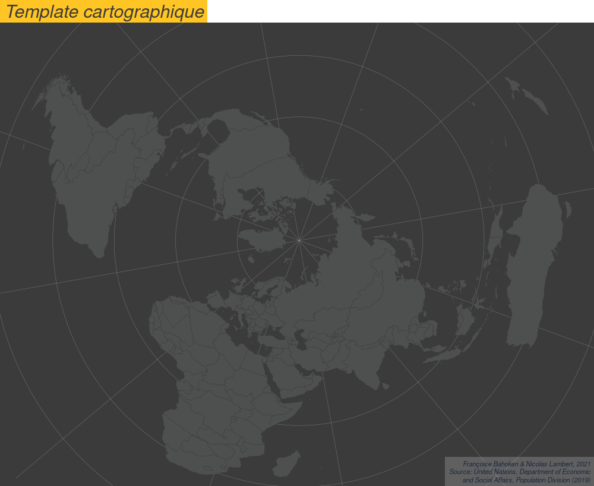
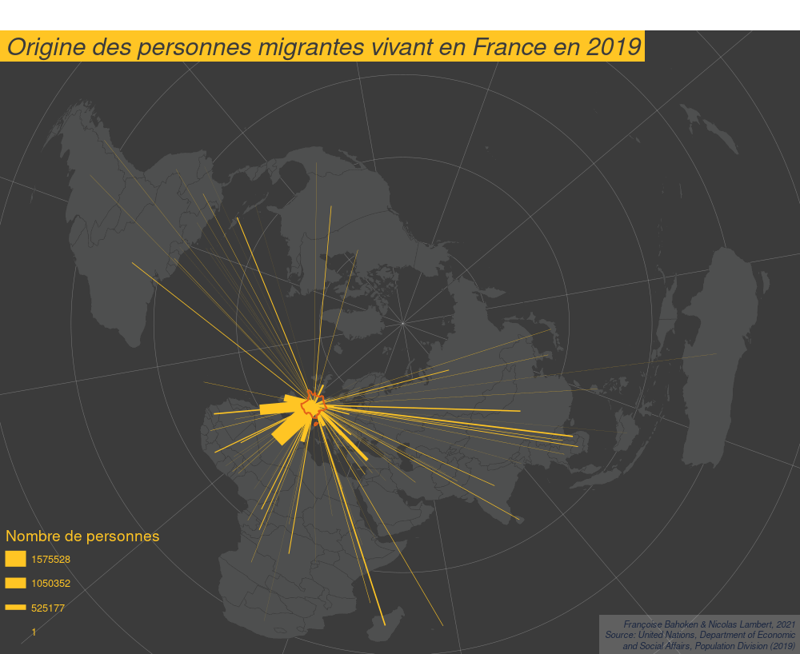
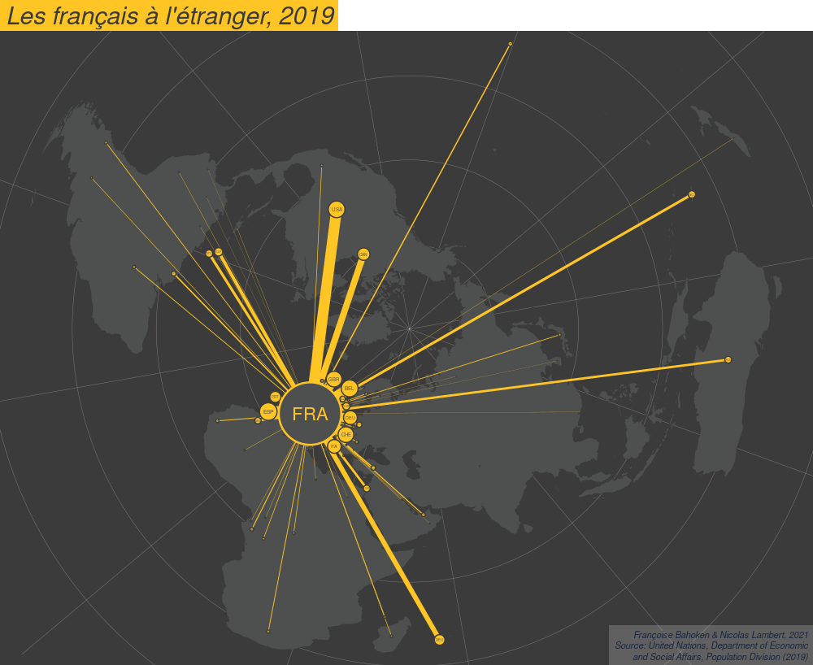
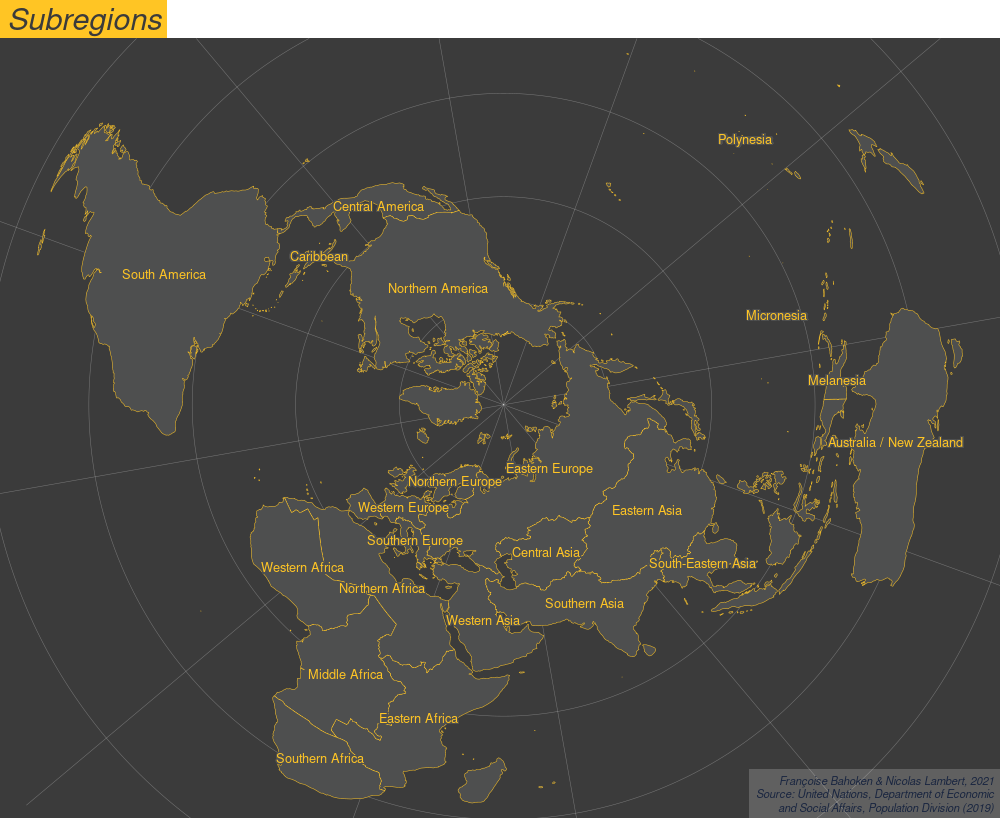
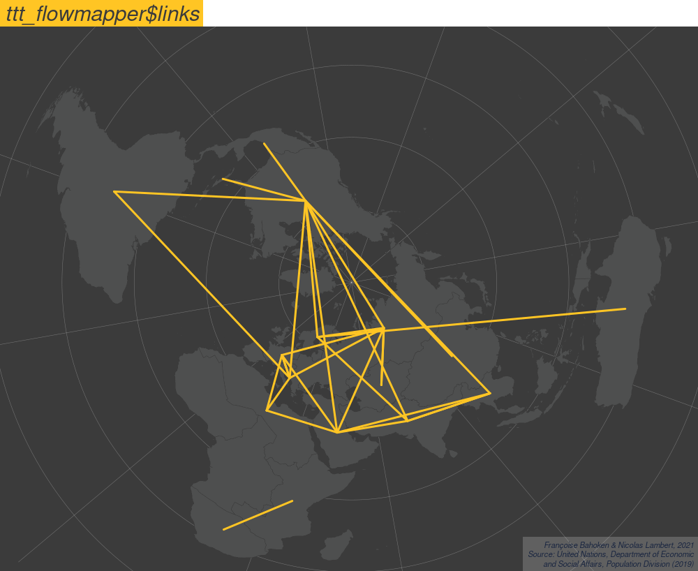
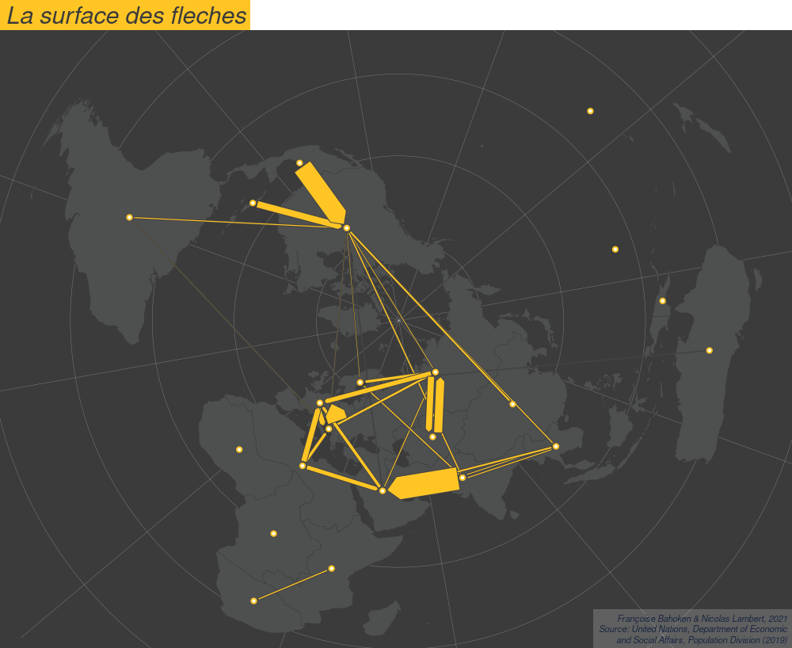
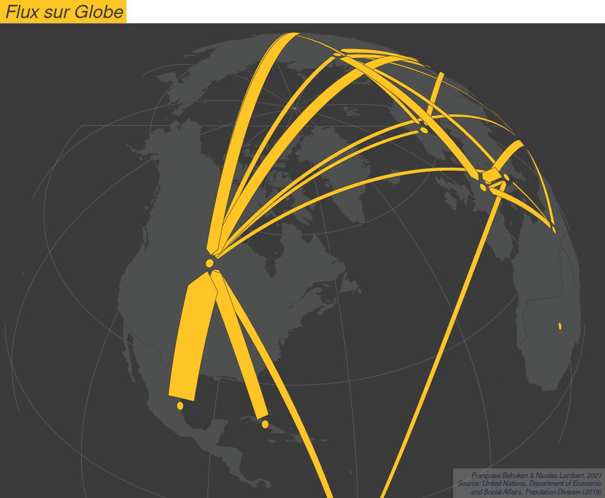
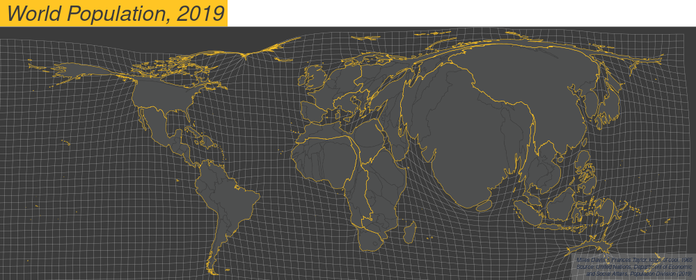

**L'objectif de cette séance est de présenter la construction de différentes cartes de flux décrivant des flux migratoires internationaux observés à l'échelle mondiale. Pour cela, nous mobilisons une matrice de flux origine-destination (OD) internationale (pays * pays) asymétrique, ainsi qu'un fond de carte des pays du monde. Ces données statistiques et géographiques vont être traitées afin d'enrichir la représentation. L'ensemble des étapes est codé dans R, sous une forme qui n'est pas toujours optimisée et beaucoup des traitements réalisés mobilisent {R base}. </br> Le présent document présente l'ensemble de la chaîne de traitement : de la préparation des matrices OD, celle des fonds de carte à la représentation des flux du point de vue de lieux d'origine (ou de destination) et/ou des échanges entre OD, entraînant beaucoup de manipulations. </br> L'idée n'est donc pas de commenter le code _in extenso_, mais d'expliciter une démarche, c'est-à-dire de montrer comment on peut réaliser des cartes de flux dans R selon différentes perspectives, dans le cadre démarche traçable, partageable et reproductible**


1. Créez un projet R et un script R.
2. Créez un repertoire *data* pour stocker les données.
3. Créez un répertoire *maps* dans lequel seront stockées les cartes

</img>

> Ce document est accessible à l'adresse suivante [https://transcarto.github.io/rflows/TRANSCARTO_flows.html](https://transcarto.github.io/rflows/TRANSCARTO_flows.html)

> Le code source est disponible ici [https://github.com/transcarto/rflows](https://github.com/transcarto/rflows)

# Les packages

Avant de commencer, voici la liste des packages à installer et à charger. Les 3 packages les plus importants sont *sf*, *mapsf* et *ttt*.


```{r, eval = FALSE, message = FALSE, warning = FALSE}
install.packages("sf")
install.packages("remotes")
install.packages("smoothr")
install.packages("readxl")
install.packages("comparator")
install.packages("reshape2")
install.packages("dplyr")
library("remotes")
#install_github("riatelab/mapsf")
install.packages("mapsf")
install.packages("cartograflow")
install_github("tributetotobler/ttt")
```

```{r, eval = TRUE, message = FALSE, warning = FALSE}
library("sf")
library("mapsf")
library("ttt")
library("readxl")
library("comparator")
library("reshape2")
```
# Les données

**Données géométriques**

Ici, nous utilisons des données géométriques sur mesure préparées en amont, qui permettent de coller exactement avec les données à cartographier. Il s'agit d'un fond de carte des pays du monde dont la nomenclature correspond à celle des données statistiques fournies par les Nations unies. 

```{r, eval = TRUE, message = FALSE, warning = FALSE, results = "hide"}
countries <- st_read("https://raw.githubusercontent.com/transcarto/rflows/master/data/world/geom/countries.geojson")
graticule <- st_read("https://raw.githubusercontent.com/transcarto/rflows/master/data/world/geom/graticule.geojson")
bbox <- st_read("https://raw.githubusercontent.com/transcarto/rflows/master/data/world/geom/bbox.geojson")

crs <-
  "+proj=aeqd +lat_0=90 +lon_0=50 +x_0=0 +y_0=0 +datum=WGS84 +units=m +no_defs "
countries <- st_transform(x = countries, crs = crs)
graticule <- st_transform(x = graticule, crs = crs)
bbox <- st_transform(x = bbox, crs = crs)
land <- st_union(countries)
```

Réalisation d'un template cartographique avec mapsf


```{r, eval = TRUE, message = FALSE, warning = FALSE}
col = "#ffc524"
credit = paste0(
  "Françoise Bahoken & Nicolas Lambert, 2021\n",
  "Source: United Nations, Department of Economic\n",
  "and Social Affairs, Population Division (2019)"
)

theme <- mf_theme(
  x = "default",
  bg = "#3b3b3b",
  fg = "#ffc524",
  mar = c(0, 0, 2, 0),
  tab = TRUE,
  pos = "left",
  inner = FALSE,
  line = 2,
  cex = 1.9,
  font = 3
)

template = function(title, file) {
  mf_export(
    countries,
    export = "png",
    width = 1000,
    filename = file,
    res = 96,
    theme = theme,
    expandBB = c(-.02, 0, -.02, 0)
  )
  mf_map(
    bbox,
    col = "#3b3b3b",
    border = NA,
    lwd = 0.5,
    add = TRUE
  )
  mf_map(graticule,
         col = "#FFFFFF50",
         lwd = 0.5,
         add = TRUE)
  mf_map(
    countries,
    col = "#4e4f4f",
    border = "#3b3b3b",
    lwd = 0.5,
    add = TRUE
  )
  # mf_map(links, col = NA,border = "#317691", lwd = 0.5, add = TRUE)
  mf_credits(
    txt = credit,
    pos = "bottomright",
    col = "#1a2640",
    cex = 0.7,
    font = 3,
    bg = "#ffffff30"
  )
  mf_title(title)
}
```

```{r, eval = TRUE, message = FALSE, warning = FALSE, results = "hide"}
template("Template cartographique", "maps/template.png")
dev.off()
```

</img>

**Données de flux Origine-Destination**

Nous utilisons un jeu de données sur les migrations internationales. _Migration Stock at subregional level_, 2019 Source : United Nations, Department of Economic and Social Affairs, Population Division (2019).

Celui-ci est proposé au format xls. Nous l'importons et le mettons en forme via le code ci-dessous.

> [Voir les données](data/world/UN_MigrantStockByOriginAndDestination_2019.xlsx)

</png>

**Précisions sur les données** : Ce jeu décrit l'effectif de populations partie ou acceuillie dans un pays autre que le leur, autorisant ainsi une représentation sous la forme de stocks et/ou sous la forme de flux de populations étrangères. Ces flux mettent en relation des pays de résidence (ceux de destination, placés en lignes dans le fichier .xls) avec des pays d’origine (ceux de départ, placés en colonnes dans le fichier .xls), correspondant à ceux dont les personnes recensées en tant qu’étrangères portent la nationalité. Il reconstruit par là une donnée origine-destination (OD) à partir d'effectifs de migrants que l'on est autorisés de représenter sous la forme de flux. 


Téléchargez le fichier [UN_MigrantStockByOriginAndDestination_2019.xlsx](https://raw.githubusercontent.com/transcarto/rflows/master/data/UN_MigrantStockByOriginAndDestination_2019.xlsx] ) et placez-le dans votre répertoire data.

Cette opération peut se faire avec le code suivant :

```{r, eval = TRUE, message = FALSE, warning = FALSE, results = "hide"}
data_url <-
  "https://raw.githubusercontent.com/transcarto/rflows/master/data/world/UN_MigrantStockByOriginAndDestination_2019.xlsx"
file <- "data/UN_MigrantStockByOriginAndDestination_2019.xlsx"
if (!file.exists(file)) {
  download.file(url = data_url, destfile = file)
} 
```

Choix de la feuille et de l'année de référence

```{r, eval = TRUE, message = FALSE, warning = FALSE, results = "hide"}
sheet <- "Table 1"
year <- 2019
```

Import et mise en forme

```{r, eval = TRUE, message = FALSE, warning = FALSE, results = "hide"}
migr <- data.frame(read_excel(file, skip = 15, sheet = sheet))
migr <- migr[migr[, 1] == year, ]

migr <- migr[!is.na(migr[, 6]), ]
migr <-
  subset(migr,
         select = -c(...1, ...2, ...5, ...4, ...6, Total, Other.North, Other.South))
colnames(migr)[1] <- "i"
migr <- migr[order(migr[, "i"], decreasing = FALSE), ]
for (i in 2:length(colnames(migr))) {
  migr[, i] <- as.numeric(migr[, i])
}
```

Affectation des codes ISO du fond du carte en ligne et en colonne

```{r, eval = TRUE, message = FALSE, warning = FALSE}
ctr <- countries[,2:4] %>% st_drop_geometry()
ctr <- ctr[order(ctr[,"label"], decreasing =FALSE),]
codes <- ctr$adm0_a3_is

# Verification manuelle
ctr$rows <- migr[,"i"]
ctr$cols <- colnames(migr)[-1]
for(i in 1:nrow(ctr)){
  ctr$rows_test[i] = LCS(similarity = TRUE)(ctr$label[i], ctr$rows[i]) / ((nchar(ctr$label[i]) + nchar(ctr$rows[i])) / 2) * 100
  ctr$cols_test[i] = LCS(similarity = TRUE)(ctr$label[i], ctr$cols[i]) / ((nchar(ctr$label[i]) + nchar(ctr$cols[i])) / 2) * 100
}
```

```{r, eval = TRUE, message = FALSE, warning = FALSE}
knitr::kable(ctr[c(0:10),], row.names = F, digits = 1)
```

```{r, eval = TRUE, message = FALSE, warning = FALSE, results = "hide"}
rownames(migr) <- codes
colnames(migr) <- c("i",codes)
migr <- migr[,-1]
```

```{r, eval = TRUE, message = FALSE, warning = FALSE}
knitr::kable(migr[c(0:15),c(0:15)], row.names = T, digits = 1)
```
Transposition de la matrice

```{r, eval = TRUE, message = FALSE, warning = FALSE, results = "hide"}
migr <- t(migr) 
```

Passage de la matrice du format large (wide) au format long (liste) i, j, fij

```{r, eval = TRUE, message = FALSE, warning = FALSE, results = "hide"}
migr <- melt(migr)
colnames(migr) = c("i", "j", "fij")
migr = migr[!is.na(migr$fij), ]
migr = migr[migr$fij > 0, ]
migr = migr[order(migr$fij, decreasing = TRUE), ]
```

```{r, eval = TRUE, message = FALSE, warning = FALSE}
knitr::kable(migr[c(0:10),], row.names = F, digits = 1)
```

Sauvegarder du fichier mis en forme au format .csv

```{r, eval = TRUE, message = FALSE, warning = FALSE}
write.csv(migr, "data/migr.csv", row.names = FALSE)
```

Ce fichier de données correctement formaté est dorénavant accessible comme ceci.

```{r, eval = TRUE, message = FALSE, warning = FALSE}
migr <- read.csv("data/migr.csv")
```

Calculs d'indicateurs avec la package *cartograflow*. Ce package, développé par Françoise Bahoken, contient des fonctions permettant de préparer et de filtrer la matrice origine-destination à des fins de cartographie thématique des flux. 

Vérification si la matrice est carrée, car le calcul des indicateurs s'appuie sur la propriété générale de symétrie de la matrice par rapport à la diagonale principale**

```{r, eval = TRUE, message = FALSE, warning = FALSE}
library("cartograflow")
```

```{r, eval = TRUE, message = FALSE, warning = FALSE}
tabflow <- migr

#Verification si la matrice est carree et fermee

matflow <- flowtabmat(tabflow, matlist = "M")

# Rendre la matrice carree
#---------------------

# on cree une liste des codes ISO de l'ensemble des entités
library("dplyr")

liste <- countries %>% select(adm0_a3_is)
liste <- as.data.frame(liste$adm0_a3_is)

#on s'en sert pour creer la matrice

tabflow2 <- flowcarre(
  tab = tabflow,
  liste = liste,
  origin = "i",
  dest = "j",
  valflow = "fij",
  format = "L",
  diagonale = TRUE,
  empty.sq = FALSE
)

#on renomme les variables correctement
colnames(tabflow2) <- c("i", "j", "fij")

tabflow2$i <- as.character(tabflow2$i)
tabflow2$j <- as.character(tabflow2$j)
tabflow2$fij <- as.numeric(tabflow2$fij)

# On calcule des indicateurs fondés sur la symétrie

# Volume bilateral as Tobler

flow_vol2 <- flowtype(
  tabflow2,
  origin = "i",
  destination = "j",
  fij = "fij",
  format = "L",
  x = "bivolum"
)

# solde/balance bilateral as Tobler

flow_net2 <- flowtype(
  tabflow2,
  origin = "i",
  destination = "j",
  fij = "fij",
  format = "L",
  x = "bibal"
)


#calcul de plusieurs indicateurs
flow_indic <-
  flowtype(
    tabflow2,
    origin = "i",
    destination = "j",
    fij = "fij",
    format = "L",
    x = "alltypes"
  )

#suppression des NA car divisions par zero

for (i in 1:nrow(flow_indic))
  for (j in 1:ncol(flow_indic))
  {
    if (is.na.data.frame(flow_indic[i, j]) == TRUE) {
      flow_indic[i, j] <- 0
    }
  }

head(flow_indic)

```

Sauvegarde de la matrice carree et fermée avec des zéros. C'est important car permet de calculer la densité de la matrice (tx de remplissage) = nb de liens renseignes / nb de liens theoriques. Ce qui est un premier indicateur**

Sauvegarde du fichier (matrice carrée incluant les zero) mis en forme au format .csv
```{r, eval = TRUE, message = FALSE, warning = FALSE}
write.csv(tabflow2, "data/migr2.csv", row.names = FALSE)
```

Ce fichier de données correctement formaté est dorénavant accesible comme ceci.

```{r, eval = TRUE, message = FALSE, warning = FALSE}
tabflow2 <- read.csv("data/migr2.csv")
```

Tout est prêt. Avançons ...

# Premières explorations

On considère la matrice migr : elle est formée de 11305 couples d'OD et de 3 variables.

```{r, eval = TRUE, message = FALSE, warning = FALSE}
migr <- read.csv("data/migr.csv")
dim(migr)
```

## L'effet Spaghetti

Création d'une couche de liens correspondant aux 11305 lignes de la matrice migr

```{r, eval = TRUE, message = FALSE, warning = FALSE}
links <-
  mf_get_links(
    x = countries,
    df = migr,
    x_id = "adm0_a3_is",
    df_id = c("i", "j")
  )
```

Cartographie de ces liens en utilisant le template. La carte spaghetti.png est enregistrée dans le répertoire ./maps

```{r, eval = TRUE, message = FALSE, warning = FALSE, results = "hide"}
template("L'effet Spaghetti ", "maps/spaghetti.png")
mf_map(links, col = col, add = TRUE)
mf_map(land,
       col = NA,
       border = "#3b3b3b",
       add = TRUE)
dev.off()
```

</img>

Pour simplifier l'image de ces flux (réduire le nombre de signes représentés), plusieurs possibilités sont envisageables. L'une d'entre elles consiste à sélectionner les signes à représenter en raisonant soit sur les lignes/colonnes de la matrice (donc sur les lieux d'origine/destination) et/ou soit sur le coeur de la matrice (sur les relations). 

Commençons par raisonner sur les lieux.

## Choix d'un pays de référence

Pour simplifier la carte, choisissons un seul pays de référence depuis/vers lequel on observe les flux.

```{r, eval = TRUE, message = FALSE, warning = FALSE, results = "hide"}
ISO3 <- "FRA"
label = "France"
```

Création d'une sous-matrice migrFRA des flux à destination de la France, jointure et mise en forme des données

```{r, eval = TRUE, message = FALSE, warning = FALSE, results = "hide"}
countr <- countries[, c("adm0_a3_is", "label")]
migrFRA <- migr[migr$j == ISO3, ]
migrFRA$fij <- as.numeric(migrFRA$fij)
maxval = max(migrFRA$fij)
total = round(sum(migrFRA$fij) / 1000000,1)
countr <-
  merge(
    x = countr,
    y = migrFRA,
    by.x = "adm0_a3_is",
    by.y = "i",
    all.x = TRUE
  )
countr <- countr[-3]
colnames(countr) <- c("id", "label", "fij", "geometry")
```


```{r, eval = TRUE, message = FALSE, warning = FALSE}
knitr::kable(countr[c(0:10),], row.names = F, digits = 1)
```

Réalisation d'une première carte de stocks sur le nombre d'étrangers présents en France : ; elle correspond à la somme marginale de la colonne iso3=FRA.

```{r, eval = TRUE, message = FALSE, warning = FALSE, results = "hide"}
template(paste0("En 2019, il y avait ",total, " millions d'étrangers en France"),
         "maps/prop1.png")
#mf_map(countr[countr$id == ISO3,], col = col, border = "red", lwd = 2, add = TRUE)
mf_map(
  countr[countr$id != ISO3, ],
  var = "fij",
  col = col,
  border = "white",
  type = "prop",
  val_max = maxval,
  inches = 0.4,
  leg_title_cex = 1.2,
  leg_val_cex   = 0.8,
  leg_pos = "bottomleft",
  leg_title = "Nombre de personnes"
)
mf_map(
  countr[countr$id == ISO3, ],
  col = NA,
  border = "#e36019",
  lwd = 2,
  add = TRUE
)
dev.off()
```

</img>

Création d'une sous-matrice migrFRA des flux originaires de la France, jointure et mise en forme des données

```{r, eval = TRUE, message = FALSE, warning = FALSE, results = "hide"}
countr <- countries[, c("adm0_a3_is", "label")]
migrFRA <- migr[migr$i == ISO3, ]
migrFRA$fij <- as.numeric(migrFRA$fij)
total = round(sum(migrFRA$fij) / 1000000,1)
countr <-
  merge(
    x = countr,
    y = migrFRA,
    by.x = "adm0_a3_is",
    by.y = "j",
    all.x = TRUE
  )
countr <- countr[-3]
colnames(countr) <- c("id", "label", "fij", "geometry")
```

Réalisation d'une seconde carte de stocks sur le nombre de français à l'étranger ; elle correspond à la somme marginale de la ligne iso3=FRA.

```{r, eval = TRUE, message = FALSE, warning = FALSE, results = "hide"}
template(paste0("En 2019, il y avait ",total, " millions de Français à l'étranger"),
         "maps/prop2.png")
mf_map(
  countr[countr$id != ISO3, ],
  var = "fij",
  col = col,
  border = "white",
  type = "prop",
  val_max = maxval,
  inches = 0.4,
  leg_title_cex = 1.2,
  leg_val_cex   = 0.8,
  leg_pos = "bottomleft",
  leg_title = "Nombre de personnes"
)
mf_map(
  countr[countr$id == ISO3, ],
  col = NA,
  border = "#e36019",
  lwd = 2,
  add = TRUE
)
dev.off()
```

</img>

Raisonnons maintenant sur les relations entre les lieux.

## Choix des relations avec un pays de référence

Réalisation d'une troisième carte mettant en relation la France avec les pays d'origine des étrangers qui résident sur le territoire national, et pondération de ces liens en fonction du nombre de personnes concernées.


Préparation d'une sous-matrice migrtoFRA formée des liens entrant dans la colonne iso3=FRA.

```{r, eval = TRUE, message = FALSE, warning = FALSE, results = "hide"}
ISO3 <- "FRA"
label = "France"
migrtoFRA <- migr[migr$j == ISO3,]
migrtoFRA$fij <- as.numeric(migrtoFRA$fij)
```

Création de la couche de liens correspondante

```{r, eval = TRUE, message = FALSE, warning = FALSE, results = "hide"}
links <-
  mf_get_links(
    x = countries,
    df = migrtoFRA,
    x_id = "adm0_a3_is",
    df_id = c("i", "j")
  )
```

Cartographie de ces liens avec une dimension de largeur proportionnelle à l'effectif de fij

```{r, eval = TRUE, message = FALSE, warning = FALSE, results = "hide"}
template(
  paste0("Origine des personnes étrangères vivant en ", label, " en 2019"),
  "maps/links1.png"
)
mf_map(
  links,
  var = "fij",
  col = col,
  border = "white",
  type = "prop",
  inches = 10,
  leg_title_cex = 1.2,
  leg_val_cex   = 0.8,
  leg_pos = "bottomleft",
  leg_title = "Nombre de personnes"
)
mf_map(
  countries[countries$adm0_a3_is == ISO3, ],
  col = "#4e4f4f",
  border = col,
  lwd = 1.5,
  add = TRUE
)
dev.off()
```

</img>

La matrice étant orientée, il est possible de raisonner selon les flux entre les lieux, qu'il convient de préparer

# Filtrages et indicateurs

**Le principe général est de sélectionner les liens à représenter pour ne représenter que ceux jugés "significatifs". Le filtrage peut être soit global (on applique une valeur unique en deça/au-dessus de laquelle les flux ne seront pas représentés) ou soit local, concernant les lieux (on filtre les flux en fonction de considérations sur les l'origie et/ou la destination).**

## Application d'un critère global

Tobler indique que seuls les flux supérieurs à la moyenne devront être représentés.
On peut faire un test. Ce critère n'est pas toujours suffisant, car dépend de la densité de la matrice. Il est plus prudent de sélectionner un critère selon les quantile.

```{r, eval = TRUE, message = FALSE, warning = FALSE, results = "hide"}

tabflow2 <- read.csv("data/migr2.csv")

fij <- (tabflow2$fij)

mean <- mean(fij)     #as Tobler

#Q3<-quantile(flow$fij,0.75)   #25% of the most important migrations
#Q95<-quantile(flow$fij, 0.95) # 5% of the most important migrations
#Q98<-quantile(flow$fij, 0.98) # 2% of the most important migrations


```

Flux supérieurs à la moyenne


# Vers des cartes un peu plus graphiques

## Une carte un peu plus sophistiquée avec *packcircles*

Avec le code ci-dessous, on cherche à réaliser une carte à la façon de cette application interactive.

> [migrExplorer](https://analytics.huma-num.fr/Nicolas.Lambert/migrexplorer/)

```{r, eval = TRUE, message = FALSE, warning = FALSE, results = "hide"}
ISO3 <- "FRA"
label = "France"
migrFRA <- migr[migr$j == ISO3,]
migrFRA$fij <- as.numeric(migrFRA$fij)
migrFRA <-
  rbind.data.frame(migrFRA, c(
    i = ISO3,
    j = ISO3,
    fij = sum(as.numeric(migrFRA$fij))
  ))
countr <- countries[, "adm0_a3_is"]
countr <-
  merge(
    x = countr,
    y = migrFRA,
    by.x = "adm0_a3_is",
    by.y = "i",
    all.x = TRUE
  )
colnames(countr) <- c("i", "j", "fij", "geometry")
```

```{r, eval = TRUE, message = FALSE, warning = FALSE}
knitr::kable(countr[c(0:10),], row.names = F, digits = 1)
```


Cercles avec packcircles (Dorling style)

```{r, eval = TRUE, message = FALSE, warning = FALSE, results = "hide"}
library("packcircles")
```

```{r, eval = TRUE, message = FALSE, warning = FALSE, results = "hide"}
dots = countr
st_geometry(dots) <-
  st_centroid(sf::st_geometry(dots), of_largest_polygon = TRUE)
dots <- data.frame(dots$i, dots["fij"], st_coordinates(dots))
dots = dots[, c("dots.i", "X", "Y", "fij")]
colnames(dots) <- c("id", "x", "y", "v")
dots <- dots[!is.na(dots$v), ]

k = 700000 # pour ajuster la taille des cercles
itermax = 10 # nombre d'iterations
delta = 35000
dat.init <- dots[, c("x", "y", "v", "id")]
dat.init$v <- sqrt(as.numeric(dat.init$v) * k)
simulation <- circleRepelLayout(
  x = dat.init,
  xysizecols = 1:3,
  wrap = FALSE,
  sizetype = "radius",
  maxiter = itermax,
  weights = 1
)$layout
circles <- st_buffer(sf::st_as_sf(
  simulation,
  coords = c('x', 'y'),
  crs = sf::st_crs(countries)
),
dist = simulation$radius - delta)

circles$v = dots$v
circles$id = dots$id
```

Links

```{r, eval = TRUE, message = FALSE, warning = FALSE, results = "hide"}
# Links

dots$j = "FRA"

links <-
  mf_get_links(
    x = circles,
    df = migrFRA,
    x_id = "id",
    df_id = c("i", "j")
  )
links$fij = as.numeric(links$fij)
```

Réalisation de la carte

```{r, eval = TRUE, message = FALSE, warning = FALSE, results = "hide"}
template("Les étrangers en France, 2019", "maps/migrexplorer1.png")

col2 = "#4e4f4f"

mf_map(
  land,
  col = "#4e4f4f",
  border = "#3b3b3b",
  lwd = 0.5,
  add = TRUE
)


mf_map(
  links,
  var = "fij",
  col = col,
  border = "#3b3b3b",
  type = "prop",
  lwd_max = 160,
  leg_pos = "n",
  add = TRUE
)

mf_map(
  circles[circles$id != ISO3, ],
  var = "fij",
  col = col,
  border = "#3b3b3b",
  lwd = 1.5,
  add = TRUE
)

mf_map(
  circles[circles$id == ISO3, ],
  var = "fij",
  col = col2,
  border = col,
  lwd = 2.5,
  add = TRUE
)

t =  circles[circles$id != ISO3, ]
mf_label(
  t,
  var = "id",
  halo = FALSE,
  cex = sqrt(as.numeric(t$v) / 1200000),
  col = col2,
  overlap = TRUE,
  lines = FALSE
)

t =  circles[circles$id == ISO3, ]
mf_label(
  t,
  var = "id",
  halo = FALSE,
  cex = sqrt(as.numeric(t$v) / 1200000),
  col = col,
  overlap = TRUE,
  lines = FALSE
)

dev.off()
```

</img>

Comme précédemment, on peut faire la carte des français présents à l'étranger, en regardant la destination

```{r, eval = TRUE, message = FALSE, warning = FALSE, results = "hide"}
ISO3 <- "FRA"
label = "France"
migrFRA <- migr[migr$i == ISO3,] # ici
migrFRA$fij <- as.numeric(migrFRA$fij)
migrFRA <-
  rbind.data.frame(migrFRA, c(
    i = ISO3,
    j = ISO3,
    fij = sum(as.numeric(migrFRA$fij))
  ))
countr <- countries[, "adm0_a3_is"]
countr <-
  merge(
    x = countr,
    y = migrFRA,
    by.x = "adm0_a3_is",
    by.y = "j", # là
    all.x = TRUE
  )
colnames(countr) <- c("i", "j", "fij", "geometry")
```

```{r, eval = TRUE, message = FALSE, warning = FALSE, results = "hide"}
dots = countr
st_geometry(dots) <-
  st_centroid(sf::st_geometry(dots), of_largest_polygon = TRUE)
dots <- data.frame(dots$i, dots["fij"], st_coordinates(dots))
dots = dots[, c("dots.i", "X", "Y", "fij")]
colnames(dots) <- c("id", "x", "y", "v")
dots <- dots[!is.na(dots$v), ]

k = 700000 # pour ajuster la taille des cercles
itermax = 10 # nombre d'iterations
delta = 35000
dat.init <- dots[, c("x", "y", "v", "id")]
dat.init$v <- sqrt(as.numeric(dat.init$v) * k)
simulation <- circleRepelLayout(
  x = dat.init,
  xysizecols = 1:3,
  wrap = FALSE,
  sizetype = "radius",
  maxiter = itermax,
  weights = 1
)$layout
circles <- st_buffer(sf::st_as_sf(
  simulation,
  coords = c('x', 'y'),
  crs = sf::st_crs(countries)
),
dist = simulation$radius - delta)

circles$v = dots$v
circles$id = dots$id
```

Links

```{r, eval = TRUE, message = FALSE, warning = FALSE, results = "hide"}
# Links

dots$j = "FRA"

links <-
  mf_get_links(
    x = circles,
    df = migrFRA,
    x_id = "id",
    df_id = c("i", "j")
  )
links$fij = as.numeric(links$fij)
```

Réalisation de la carte

```{r, eval = TRUE, message = FALSE, warning = FALSE, results = "hide"}
template("Les français à l'étranger, 2019", "maps/migrexplorer2.png")

col2 = "#4e4f4f"

mf_map(
  land,
  col = "#4e4f4f",
  border = "#3b3b3b",
  lwd = 0.5,
  add = TRUE
)


mf_map(
  links,
  var = "fij",
  col = col,
  border = "#3b3b3b",
  type = "prop",
  lwd_max = 160,
  leg_pos = "n",
  add = TRUE
)

mf_map(
  circles[circles$id != ISO3, ],
  var = "fij",
  col = col,
  border = "#3b3b3b",
  lwd = 1.5,
  add = TRUE
)

mf_map(
  circles[circles$id == ISO3, ],
  var = "fij",
  col = col2,
  border = col,
  lwd = 2.5,
  add = TRUE
)

t =  circles[circles$id != ISO3, ]
mf_label(
  t,
  var = "id",
  halo = FALSE,
  cex = sqrt(as.numeric(t$v) / 1200000),
  col = col2,
  overlap = TRUE,
  lines = FALSE
)

t =  circles[circles$id == ISO3, ]
mf_label(
  t,
  var = "id",
  halo = FALSE,
  cex = sqrt(as.numeric(t$v) / 1200000),
  col = col,
  overlap = TRUE,
  lines = FALSE
)

dev.off()
```

</img>

Ces cartes, on peut les retrouver dans l'application MigrExplorer mise en ligne via R shiny. 

> https://gitlab.huma-num.fr/nlambert/migrexplorer/-/tree/master

## Changer de maillage

Contrairement aux cartes réalisées à l'échelle internationale (pays * pays), cartographier les flux au niveau régional permet parfois de mieux percevoir la logique d'ensemble de ces mobilités internationales. Cette carte, pas très élégante, a été réalisée et présentée par François Héran dans ses cours au Collège de France. 

</img>

Et si on essayait de la reproduire avec R ?

Pour cela, nous construisons des données de migrations internationales, en agrégeant les flux internationaux au niveau subrégional, à partir d'une clé d'aggrégation contenue dans le fichier *countries*.

```{r, eval = TRUE, message = FALSE, warning = FALSE}
knitr::kable(countries[c(0:10),c("adm0_a3_is", "label","Code2","Label2")], row.names = F, digits = 1)
```

Géométries

```{r, eval = TRUE, message = FALSE, warning = FALSE, results = "hide"}
subregions <-
  aggregate(countries, by = list(countries$Code2), FUN = head, 1)
subregions <- subregions[, c("Code2", "Label2")]
st_geometry(subregions) <-
  st_cast(subregions$geometry, "MULTIPOLYGON")
colnames(subregions) <- c("id", "label", "geometry")
```

```{r, eval = TRUE, message = FALSE, warning = FALSE, results = "hide"}
template("Subregions", "maps/subregions.png")
mf_map(
  subregions,
  col = "#4e4f4f",
  border = col,
  lwd = 0.5,
  add = TRUE
)
mf_label(
  x = subregions,
  var = "label",
  halo = TRUE,
  bg = "#4e4f4f",
  cex = 0.8,
  col = col,
  overlap = TRUE,
  lines = FALSE
)
dev.off()
```
</img>

Données attributaires

```{r, eval = TRUE, message = FALSE, warning = FALSE, results = "hide"}
keys <- data.frame(countries[, c("adm0_a3_is", "Code2")])
keys$geometry <- NULL
migr <- merge(x = migr,
              y = keys,
              by.x = "i",
              by.y = "adm0_a3_is")
colnames(migr)[4] <- "subreg_i"
migr <- merge(x = migr,
              y = keys,
              by.x = "j",
              by.y = "adm0_a3_is")
colnames(migr)[5] <- "subreg_j"
migr$id <- paste0(migr$subreg_i, "_", migr$subreg_j)
migr2 <- aggregate(migr$fij, by = list(migr$id), FUN = sum)
migr2$i <- sapply(strsplit(migr2$Group.1, "_"), "[", 1)
migr2$j <- sapply(strsplit(migr2$Group.1, "_"), "[", 2)
migr2 <- migr2[, c("i", "j", "x")]
colnames(migr2)[3] <- "fij"
migr2$fij <- round(migr2$fij / 1000, 0)
```

```{r, eval = TRUE, message = FALSE, warning = FALSE}
knitr::kable(migr2[c(0:10),], row.names = F, digits = 1)
```

On ajoute au fond de carte les flux intrarégionaux

```{r, eval = TRUE, message = FALSE, warning = FALSE, results = "hide"}
flowsintra <- migr2[migr2$i == migr2$j,c("i","fij")]
colnames(flowsintra) <- c("id","intra")
subregions <- merge(x = subregions, y = flowsintra, by = "id")
```

```{r, eval = TRUE, message = FALSE, warning = FALSE}
knitr::kable(subregions[c(0:10),], row.names = F, digits = 1)
```

Calcul du volume bilatéral d'interactions inter régionales (A -> B) + (B -> A) ou (fij)+(fji)

```{r, eval = TRUE, message = FALSE, warning = FALSE, results = "hide"}
migr2 <- migr2[migr2$i != migr2$j,]
for (k in 1:length(migr2$i)) {
  val1 <- migr2$fij[k]
  val2 <-
    migr2[migr2$i == migr2$j[k] & migr2$j == migr2$i[k], "fij"]
  migr2$interaction[k] <- sum(val1, val2)
}

# Suppression des doublons
interactions = data.frame(matrix(
  ncol = 3,
  nrow = 0,
  dimnames = list(NULL, c("i", "j", "interaction"))
))
for (k in 1:length(migr2$i)) {
  idi = migr2$i[k]
  idj = migr2$j[k]
  test = length(interactions[(interactions$i == idi &
                                interactions$j == idj) |
                               (interactions$i == idj & interactions$j == idi), "interaction"])
  if (test == 0) {
    interactions <-
      rbind(interactions, data.frame(
        i = idi,
        j = idj,
        interaction = migr2$interaction[k]
      ))
  }
}
```

```{r, eval = TRUE, message = FALSE, warning = FALSE}
knitr::kable(interactions[c(0:10),], row.names = F, digits = 1)
```

**Choix du critère de sélection global**

On décide d'éliminer les petits flux, c'est-à-dire les signes graphiques présentant des valeurs de flux faibles pour ne pas se trouver face à un effet spaghetti.

Tobler recommande en première intention de ne représenter que les flux qui sont supérieurs au flux moyen 

```{r, eval = TRUE, message = FALSE, warning = FALSE, results = "hide"}
mean<-mean(interactions$interaction)
```

Cependant, ce seuil à 829 personnes (flux interregional moyen) ne nous apparaît pas assez élevé car 1) il n'éclaircit pas suffisament la figure et 2) il ne nous  permet pas de coller suffisament à la carte de F. Héran.

Nous changeons de logique et raisonnons selon les posiions, les déciles, pour ne représenter que la part en % de flux qui contribuent à une visualisation d'une part importante de l'interaction totale.  

Nous décidons alors de ne représenter que les 10% de signes qui contribuent à l'interaction totale la plus forte

```{r, eval = TRUE, message = FALSE, warning = FALSE, results = "hide"}
Q90<-quantile(interactions$interaction, 0.90)  #10% des migrations les plus importantes
```

Pour simplifier, on fixe le critère de sélection à 2000

```{r, eval = TRUE, message = FALSE, warning = FALSE, results = "hide"}
threshold <- 2000
interactions <- interactions[interactions$interaction >= threshold,]
```

construction des liens inter regionaux

```{r, eval = TRUE, message = FALSE, warning = FALSE, results = "hide"}
links <-
  mf_get_links(
    x = subregions,
    df = interactions,
    x_id = "id",
    df_id = c("i", "j")
  )
```

Cartographie

```{r, eval = TRUE, message = FALSE, warning = FALSE, results = "hide"}

template("L'Afrique, un continent encore isolé dans la mondialisation", "maps/heran.png")

col2 = "#4e4f4f"

mf_map(
  subregions,
  col = "#4e4f4f",
  border = "#3b3b3b",
  lwd = 0.5,
  add = TRUE
)


mf_map(
  links,
  var = "interaction",
  col = col,
  border = "#3b3b3b",
  type = "prop",
  lwd_max = 25,
  leg_pos = "bottomleft",
  leg_title = paste0("Migratons INTER régionales (interactions)\n(A -> B) + (B -> A)\nSeuil : ",threshold, "\nen milliers de personnes"),
  add = TRUE
)

mf_map(
  subregions,
  var = "intra",
  col = "#3b3b3b",
  border = col,
  lwd = 1.5,
  type = "prop",
  symbol = "square",
  leg_pos = "topright",
  leg_title = "Migrations INTRA\nrégionale nen 2019\n(en milliers)",
  add = TRUE
)

mf_label(
  subregions,
  var = "intra",
  halo = FALSE,
  cex = sqrt(as.numeric(subregions$intra) / 12000),
  col = col,
  overlap = TRUE,
  lines = FALSE
)

mf_label(
  links,
  var = "interaction",
  halo = TRUE,
  cex = 0.5,
  col = col2,
  bg = col,
  r = 0.1,
  overlap = FALSE,
  lines = FALSE
)

dev.off()

```

</img>

**Problème : avec seulement mapsf, on a du mal à représenter des flèches et surtout, des flèches bilatérales A -> B et B -> A qui respectent les principes de la sémiologie cartographique des flux en étant parallèles et convergentes/divergentes vers/depuis les lieux. La solution : Flowmapper** 👍

# Flowmapper

flowmapper() est une fonction du package ttt (en cours de développement) dédié à la ré-écriture/extension de programmes initialement proposés par Tobler. 

```{r, eval = TRUE, message = FALSE, warning = FALSE, results = "hide"}
library("ttt")
```

## Les données

Dans le package ttt, il y a des données d'exemple au niveau subrégional. Chargeons-les. 


```{r, eval = TRUE, message = FALSE, warning = FALSE, results = "hide"}

#subregions <- st_read(system.file("subregions.gpkg", package="flowmapper")) %>% st_transform(crs)
#migr <- read.csv(system.file("migrantstocks2019.csv", package="flowmapper"))

subregions <- st_read(system.file("subregions.gpkg", package="ttt")) %>% 
  st_transform(crs)
migr <- read.csv(system.file("migrantstocks2019.csv", package="ttt"))

```

Sélection des flux les plus importants (environ 1/3 des plus forts)

```{r, eval = TRUE, message = FALSE, warning = FALSE, results = "hide"}
#mean_migr<-mean(migr$fij)
Q65_migr<-quantile(migr$fij, 0.65) #1/3 des migrations les plus importantes

```


```{r, eval = TRUE, message = FALSE, warning = FALSE, results = "hide"}
threshold <- 1500
migr <- migr[migr$fij >= threshold, ]
```


```{r, eval = TRUE, message = FALSE, warning = FALSE}
knitr::kable(migr[c(0:10),], row.names = F, digits = 1)
```

```{r, eval = TRUE, message = FALSE, warning = FALSE, results = "hide"}
flows <- ttt_flowmapper(
  x = subregions,
  xid = "id",
  df = migr,
  dfid = c("i", "j"),
  dfvar = "fij",
  plot = FALSE
)
```

## Liens

```{r, eval = TRUE, message = FALSE, warning = FALSE, results = "hide"}
template("ttt_flowmapper$links", "maps/ttt_links.png")
mf_map(
  subregions,
  col = "#4e4f4f",
  border = "#3b3b3b",
  lwd = 0.5,
  add = TRUE
)
mf_map(flows$links,
       col = col,
       lwd = 3,
       add = TRUE)
dev.off()
```

</img>

## Cercles

```{r, eval = TRUE, message = FALSE, warning = FALSE, results = "hide"}
template("ttt_flowmapper$circles", "maps/ttt_circles.png")
mf_map(
  subregions,
  col = "#4e4f4f",
  border = "#3b3b3b",
  lwd = 0.5,
  add = TRUE
)
mf_map(flows$circles, col = col, add = TRUE)
dev.off()
```

</img>

## Flèches

```{r, eval = TRUE, message = FALSE, warning = FALSE, results = "hide"}
template("ttt_flowmapper$flows", "maps/ttt_arrows.png")
mf_map(
  subregions,
  col = "#4e4f4f",
  border = "#3b3b3b",
  lwd = 0.5,
  add = TRUE
)
mf_map(flows$flows, col = col, add = TRUE)
dev.off()
```

</img>

## Visualisation par défaut

```{r, eval = TRUE, message = FALSE, warning = FALSE, results = "hide"}
template("Visulaisation par défaut", "maps/ttt_flows.png")
mf_map(
  subregions,
  col = "#4e4f4f",
  border = "#3b3b3b",
  lwd = 0.5,
  add = TRUE
)
flows <- ttt_flowmapper(
  x = subregions,
  xid = "id",
  type = "arrows",
  df = migr,
  dfid = c("i", "j"),
  dfvar = "fij",
  col = col,
  border = "#424242",
  border2 = col,
  add = TRUE
)
dev.off()
```


</img>

## La VV taille, c'est aussi la surface

```{r, eval = TRUE, message = FALSE, warning = FALSE, results = "hide"}
template("La surface des fleches", "maps/ttt_surface.png")
mf_map(
  subregions,
  col = "#4e4f4f",
  border = "#3b3b3b",
  lwd = 0.5,
  add = TRUE
)
ttt_flowmapper(
  x = subregions,
  xid = "id",
  type = "arrows",
  size = "area",
  df = migr,
  dfid = c("i", "j"),
  dfvar = "fij",
  col = col,
  border = "#424242",
  border2 = col,
  add = TRUE
)
dev.off()
```

</img>

## Epaisseur vs Surface

</img></img>

## Interactions (type = "rect")

```{r, eval = TRUE, message = FALSE, warning = FALSE, results = "hide"}
migr2 <- data.frame(i = integer(), j = integer(), fij = integer())

for (k in 1:length(migr$i)) {
  val1 <- migr$fij[k]
  val2 <- migr[migr$i == migr$j[k] & migr$j == migr$i[k], "fij"]
  val <- sum(val1, val2)
  idi =  migr$i[k]
  idj =  migr$j[k]
  test <-
    length(migr2[(migr2$i == idi &
                    migr2$j == idj) | (migr2$i == idj & migr2$j == idi), "fij"])
  if (test == 0) {
    migr2 <- rbind(migr2, data.frame(i = idi, j = idj, fij = val))
  }
}
migr2 <- migr2[migr2$i != migr2$j, ] 
```

```{r, eval = TRUE, message = FALSE, warning = FALSE}
head(migr2)
```


```{r, eval = TRUE, message = FALSE, warning = FALSE, results = "hide"}
template("Interactions", "maps/ttt_interactions.png")
c <- ttt_flowmapper(
  x = subregions,
  xid = "id",
  size = "thickness",
  type = "rect",
  df = migr2,
  dfid = c("i", "j"),
  dfvar = "fij",
  col = col,
  border = "#424242",
  border2 = col,
  add = TRUE
)
dev.off()
```

</img>

## Combiner flux intra et flux inter

```{r, eval = TRUE, message = FALSE, warning = FALSE, results = "hide"}
intra <- migr[migr$i == migr$j, ]
intra <- intra[, c("i", "fij")]
colnames(intra) <- c("id", "nb")
knitr::kable(intra, row.names = F, digits = 1)
```

Calcul des flux (plot = FALSE)

```{r, eval = TRUE, message = FALSE, warning = FALSE, results = "hide"}
flows <- ttt_flowmapper(
  x = subregions,
  xid = "id",
  df = migr,
  dfid = c("i", "j"),
  dfvar = "fij",
  size = "thickness",
  type = "arrows",
  decreasing = FALSE,
  add = TRUE,
  lwd = 1,
  col = col,
  border = "#424242",
  k = NULL,
  k2 = 60,
  df2 = intra,
  df2id = "id",
  df2var = "nb",
  col2 = "#3b3b3b",
  border2 = col,
  plot = FALSE
)
```

Affichage de la carte avec mapsf

```{r, eval = TRUE, message = FALSE, warning = FALSE, results = "hide"}
template("Flux inter et flux intra", "maps/interintra.png")

mf_shadow(x = flows$flows, col = "grey70", cex = 0.2, add = TRUE)

mf_map(
  flows$flows,
  var = "fij",
  col = col,
  border = "#3b3b3b",
  leg_pos = "n",
  add = TRUE
)

mf_map(
  flows$circles,
  var = "fij",
  col = "#3b3b3b",
  border = col,
  lwd = 1.5,
  leg_pos = "n",
  add = TRUE
)

mf_label(
  flows$circles,
  var = "nb",
  halo = FALSE,
  cex = sqrt(as.numeric(flows$circles$nb) / 18000),
  #cex = 1,
  col = col,
  overlap = TRUE,
  lines = FALSE
)


mf_label(
  flows$flows,
  var = "fij",
  halo = TRUE,
  cex = 0.7,
  col = col2,
  bg = col,
  r = 0.1,
  overlap = FALSE,
  lines = FALSE
)

# La fonction légende :-)

ttt_flowmapperlegend(
  x = flows,
  title = "Flux inter",
  title2 = "flux intra",
  col = "#4e4f4f",
  txtcol = col
)


dev.off()
```

</img>

## Reprojection

1 - calcul en projection polaire

```{r, eval = TRUE, message = FALSE, warning = FALSE, results = "hide"}
tmp <- ttt_flowmapper(
  x = subregions,
  xid = "id",
  type = "arrows",
  df = migr,
  dfid = c("i", "j"),
  dfvar = "fij",
  col = "#ffc524",
  border = "#424242",
  border2 = "#ffc524",
  plot = FALSE
)
```

2 - reprojection & nouveau template

```{r, eval = TRUE, message = FALSE, warning = FALSE, results = "hide"}
crs <-
  "+proj=ortho +lat_0=42.5333333333 +lon_0=-72.53333333339999 +x_0=0 +y_0=0 +a=6370997 +b=6370997 +units=m +no_defs"
flows <- smoothr::densify(tmp$flows, n = 30) %>% st_transform(crs)
dots <- st_transform(tmp$circles, crs)
subregions <- st_transform(subregions, crs)
graticule <- st_transform(graticule, crs)
bbox <- st_transform(bbox, crs)
```

3 - affichage

```{r, eval = TRUE, message = FALSE, warning = FALSE, results = "hide"}
title = "Flux sur Globe"
file =   "maps/ttt_globe.png"

mf_export(
  subregions,
  export = "png",
  width = 1000,
  filename = file,
  res = 96,
  theme = theme,
  expandBB = c(-.02, 0,-.02, 0)
)

mf_map(
  bbox,
  col = "#3b3b3b",
  border = NA,
  lwd = 0.5,
  add = TRUE
)

mf_map(graticule,
       col = "#FFFFFF50",
       lwd = 0.5,
       add = TRUE)

mf_map(
  subregions,
  col = "#4e4f4f",
  border = "#3b3b3b",
  lwd = 0.5,
  add = TRUE
)

mf_credits(
  txt = credit,
  pos = "bottomright",
  col = "#1a2640",
  cex = 0.7,
  font = 3,
  bg = "#ffffff30"
)

mf_map(flows, col = col, add = TRUE)

mf_map(dots, col = col, add = TRUE)

mf_title(title)

dev.off()
```

</img>

## Visualiser R/Shiny

> https://gitlab.huma-num.fr/nlambert/migrexplorer3/-/tree/master

<div align = "center">
</img>
<a href = "https://analytics.huma-num.fr/Nicolas.Lambert/migrexplorer3/" target = "_BLANK">Ouvrir l'application</img></a></div>

# A vous de jouer

Et si on essayait de faire des cartes de flux sur un fond de carte déformé. Ici, par la population en 2019.

Les données

```{r, eval = TRUE, message = FALSE, warning = FALSE, results = "hide"}
migrCountries <- read.csv("https://raw.githubusercontent.com/transcarto/rflows/master/data/world/cartogram/migr2019_T.csv")
migrSubregions <-  read.csv("https://raw.githubusercontent.com/transcarto/rflows/master/data/world/cartogram/migrSubregions2019_T.csv")
```

Les géométries

```{r, eval = TRUE, message = FALSE, warning = FALSE, results = "hide"}
countriesPop <- st_read("https://raw.githubusercontent.com/transcarto/rflows/master/data/world/cartogram/countriesPop.geojson")
subregionsPop <- st_read("https://raw.githubusercontent.com/transcarto/rflows/master/data/world/cartogram/regionsPop.geojson")
gridPop <- st_read("https://raw.githubusercontent.com/transcarto/rflows/master/data/world/cartogram/grid.geojson")
```

Quelques variables d'affichage

```{r, eval = TRUE, message = FALSE, warning = FALSE, results = "hide"}
col = "#ffc524"
votrenom = "Miles Davis & Frances Taylor, kings of cool, 1965"
```

```{r, eval = TRUE, message = FALSE, warning = FALSE, results = "hide"}

credit = paste0(
  votrenom,"\n",
  "Source: United Nations, Department of Economic\n",
  "and Social Affairs, Population Division (2019)"
)

theme <- mf_theme(
  x = "default",
  bg = "#3b3b3b",
  fg = "#ffc524",
  mar = c(0, 0, 2, 0),
  tab = TRUE,
  pos = "left",
  inner = FALSE,
  line = 2,
  cex = 1.9,
  font = 3
)

template = function(title, file) {
  mf_export(
    countriesPop,
    export = "png",
    width = 1000,
    filename = file,
    res = 96,
    theme = theme,
    expandBB = c(-.02, 0, -.02, 0)
  )

  mf_map(gridPop,
         col = "#FFFFFF70",
         lwd = 0.4,
         add = TRUE)
  mf_map(
    countriesPop,
    col = "#4e4f4f",
    border = "#3b3b3b",
    lwd = 0.5,
    add = TRUE
  )
  
    mf_map(
    subregionsPop,
    col = "NA",
    border = col,
    lwd = 0.5,
    add = TRUE
  )
  # mf_map(links, col = NA,border = "#317691", lwd = 0.5, add = TRUE)
  mf_credits(
    txt = credit,
    pos = "bottomright",
    col = "#1a2640",
    cex = 0.5,
    font = 3,
    bg = "#ffffff30"
  )
  mf_title(title)
}
```

A vous de jouer...

```{r, eval = TRUE, message = FALSE, warning = FALSE, results = "hide"}
template("World Population, 2019", "maps/cartogram.png")

# METTEZ DES TRUCS ICI ! 

dev.off()
```

</img>
