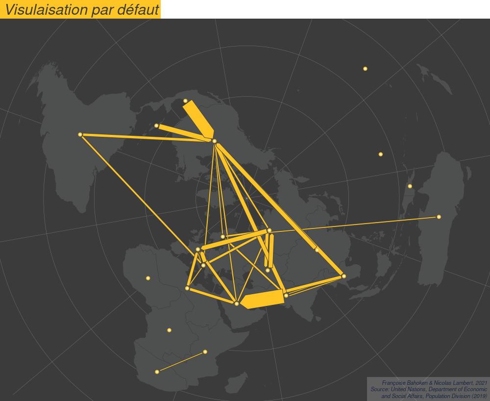

**Lorem Ipsum is simply dummy text of the printing and typesetting industry. Lorem Ipsum has been the industry's standard dummy text ever since the 1500s, when an unknown printer took a galley of type and scrambled it to make a type specimen book. It has survived not only five centuries, but also the leap into electronic typesetting, remaining essentially unchanged. It was popularised in the 1960s with the release of Letraset sheets containing Lorem Ipsum passages, and more recently with desktop publishing software like Aldus PageMaker including versions of Lorem Ipsum.**

# Les données

Jeu de données sur les migrations internationales. Migration Stock at subregional level, 2019 Source : United Nations, Department of Economic and Social Affairs, Population Division (2019). [Voir](https://www.un.org/en/development/desa/population/migration/data/estimates2/estimates19.asp)

</png>

# Les packages

```{r, eval = FALSE, message = FALSE, warning = FALSE}
install.packages("sf")
install.packages("remotes")
install.packages("smoothr")
library(remotes)
install_github("riatelab/mapsf")
install_github("tributetotobler/ttt")
```

```{r, eval = TRUE, message = FALSE, warning = FALSE}
library("sf")
library("mapsf")
library("ttt")
```

# Import et mise en forme des données

Données géométriques

```{r, eval = TRUE, message = FALSE, warning = FALSE, results = "hide"}
countries <- st_read("data/world/geom/countries.gpkg")
subregions <- st_read("data/world/geom/subregions.gpkg")
graticule <- st_read("data/world/geom/graticule.gpkg")
bbox <- st_read("data/world/geom/bbox.gpkg")

crs <-
  "+proj=aeqd +lat_0=90 +lon_0=50 +x_0=0 +y_0=0 +datum=WGS84 +units=m +no_defs "
countries <- st_transform(x = countries, crs = crs)
subregions <- st_transform(x = subregions, crs = crs)
graticule <- st_transform(x = graticule, crs = crs)
bbox <- st_transform(x = bbox, crs = crs)
land <- st_union(countries)
```

Données attributaires

```{r, eval = TRUE, message = FALSE, warning = FALSE, results = "hide"}
migr <- read.csv("data/world/fij/migr2019_T.csv")
View(migr)
```

Template cartographique


```{r, eval = TRUE, message = FALSE, warning = FALSE}
col = "#ffc524"
credit = paste0(
  "Françoise Bahoken & Nicolas Lambert, 2021\n",
  "Source: United Nations, Department of Economic\n",
  "and Social Affairs, Population Division (2019)"
)
# theme = mf_theme(x = "default", bg = "white", tab = FALSE,
#                    pos = "center", line = 2, inner = FALSE,
#                    fg = "#9F204270", mar = c(0,0, 2, 0),cex = 1.9)

theme <- mf_theme(
  x = "default",
  bg = "#3b3b3b",
  fg = "#ffc524",
  mar = c(0, 0, 2, 0),
  tab = TRUE,
  pos = "left",
  inner = FALSE,
  line = 2,
  cex = 1.9,
  font = 3
)

template = function(title, file) {
  mf_export(
    countries,
    export = "png",
    width = 1000,
    filename = file,
    res = 96,
    theme = theme,
    expandBB = c(-.02, 0, -.02, 0)
  )
  mf_map(
    bbox,
    col = "#3b3b3b",
    border = NA,
    lwd = 0.5,
    add = TRUE
  )
  mf_map(graticule,
         col = "#FFFFFF50",
         lwd = 0.5,
         add = TRUE)
  mf_map(
    countries,
    col = "#4e4f4f",
    border = "#3b3b3b",
    lwd = 0.5,
    add = TRUE
  )
  # mf_map(links, col = NA,border = "#317691", lwd = 0.5, add = TRUE)
  mf_credits(
    txt = credit,
    pos = "bottomright",
    col = "#1a2640",
    cex = 0.7,
    font = 3,
    bg = "#ffffff30"
  )
  mf_title(title)
}
```

```{r, eval = TRUE, message = FALSE, warning = FALSE, results = "hide"}
template("Template cartographique", "maps/template.png")
dev.off()
```

</img>

# Ce qu'on peut faire en R base & mapsf


## L'effet Spaghetti

```{r, eval = TRUE, message = FALSE, warning = FALSE}
links <-
  mf_get_links(
    x = countries,
    df = migr,
    x_id = "adm0_a3_is",
    df_id = c("i", "j")
  )
```


```{r, eval = TRUE, message = FALSE, warning = FALSE, results = "hide"}
template("L'effet Spaghetti ", "maps/spaghetti.png")
mf_map(links, col = col, add = TRUE)
mf_map(land,
       col = NA,
       border = "#3b3b3b",
       add = TRUE)
dev.off()
```

</img>

## Sélectionner un seul pays

Choix d'un pays

```{r, eval = TRUE, message = FALSE, warning = FALSE, results = "hide"}
ISO3 <- "FRA"
label = "France"
```

Jointure et mise en forme des données

```{r, eval = TRUE, message = FALSE, warning = FALSE, results = "hide"}
countr <- countries[, c("adm0_a3_is", "label")]
migrFRA <- migr[migr$j == ISO3, ]
migrFRA$fij <- as.numeric(migrFRA$fij)
maxval = max(migrFRA$fij)
total = round(sum(migrFRA$fij) / 1000000,1)
countr <-
  merge(
    x = countr,
    y = migrFRA,
    by.x = "adm0_a3_is",
    by.y = "i",
    all.x = TRUE
  )
countr <- countr[-3]
colnames(countr) <- c("id", "label", "fij", "geometry")
```

```{r, eval = TRUE, message = FALSE, warning = FALSE}
knitr::kable(countr[c(0:10),], row.names = F, digits = 1)
```

Une première carte simple

```{r, eval = TRUE, message = FALSE, warning = FALSE, results = "hide"}
template(paste0("En 2019, il y avait ",total, " millions d'étrangers en France"),
         "maps/prop1.png")
#mf_map(countr[countr$id == ISO3,], col = col, border = "red", lwd = 2, add = TRUE)
mf_map(
  countr[countr$id != ISO3, ],
  var = "fij",
  col = col,
  border = "white",
  type = "prop",
  val_max = maxval,
  inches = 0.4,
  leg_title_cex = 1.2,
  leg_val_cex   = 0.8,
  leg_pos = "bottomleft",
  leg_title = "Nombre de personnes"
)
mf_map(
  countr[countr$id == ISO3, ],
  col = NA,
  border = "#e36019",
  lwd = 2,
  add = TRUE
)
dev.off()
```

</img>

La carte symétrique

```{r, eval = TRUE, message = FALSE, warning = FALSE, results = "hide"}
countr <- countries[, c("adm0_a3_is", "label")]
migrFRA <- migr[migr$i == ISO3, ]
migrFRA$fij <- as.numeric(migrFRA$fij)
total = round(sum(migrFRA$fij) / 1000000,1)
countr <-
  merge(
    x = countr,
    y = migrFRA,
    by.x = "adm0_a3_is",
    by.y = "j",
    all.x = TRUE
  )
countr <- countr[-3]
colnames(countr) <- c("id", "label", "fij", "geometry")
```

```{r, eval = TRUE, message = FALSE, warning = FALSE, results = "hide"}
template(paste0("En 2019, il y avait ",total, " millions de Français à l'étranger"),
         "maps/prop2.png")
mf_map(
  countr[countr$id != ISO3, ],
  var = "fij",
  col = col,
  border = "white",
  type = "prop",
  val_max = maxval,
  inches = 0.4,
  leg_title_cex = 1.2,
  leg_val_cex   = 0.8,
  leg_pos = "bottomleft",
  leg_title = "Nombre de personnes"
)
mf_map(
  countr[countr$id == ISO3, ],
  col = NA,
  border = "#e36019",
  lwd = 2,
  add = TRUE
)
dev.off()
```

</img>

On peut faire la même carte en faisant varier l'épaisseur des liens

```{r, eval = TRUE, message = FALSE, warning = FALSE, results = "hide"}
ISO3 <- "FRA"
label = "France"
migrtoFRA <- migr[migr$j == ISO3,]
migrtoFRA$fij <- as.numeric(migrtoFRA$fij)
```

```{r, eval = TRUE, message = FALSE, warning = FALSE, results = "hide"}
links <-
  mf_get_links(
    x = countries,
    df = migrtoFRA,
    x_id = "adm0_a3_is",
    df_id = c("i", "j")
  )
```

```{r, eval = TRUE, message = FALSE, warning = FALSE, results = "hide"}
template(
  paste0("Origine des personnes migrantes vivant en ", label, " en 2019"),
  "maps/links1.png"
)
mf_map(
  links,
  var = "fij",
  col = col,
  border = "white",
  type = "prop",
  inches = 10,
  leg_title_cex = 1.2,
  leg_val_cex   = 0.8,
  leg_pos = "bottomleft",
  leg_title = "Nombre de personnes"
)
mf_map(
  countries[countries$adm0_a3_is == ISO3,],
  col = "#4e4f4f",
  border = col,
  lwd = 1.5,
  add = TRUE
)
dev.off()
```

</img>

## Une carte un peu plus sophistiquée avec *packcircles*

```{r, eval = TRUE, message = FALSE, warning = FALSE, results = "hide"}
ISO3 <- "FRA"
label = "France"
migrFRA <- migr[migr$j == ISO3,]
migrFRA$fij <- as.numeric(migrFRA$fij)
migrFRA <-
  rbind.data.frame(migrFRA, c(
    i = ISO3,
    j = ISO3,
    fij = sum(as.numeric(migrFRA$fij))
  ))
countr <- countries[, "adm0_a3_is"]
countr <-
  merge(
    x = countr,
    y = migrFRA,
    by.x = "adm0_a3_is",
    by.y = "i",
    all.x = TRUE
  )
colnames(countr) <- c("i", "j", "fij", "geometry")
```

```{r, eval = TRUE, message = FALSE, warning = FALSE}
knitr::kable(countr[c(0:10),], row.names = F, digits = 1)
```


Cercles avec packcircles (Dorling style)

```{r, eval = TRUE, message = FALSE, warning = FALSE, results = "hide"}
library(packcircles)
```

```{r, eval = TRUE, message = FALSE, warning = FALSE, results = "hide"}
dots = countr
st_geometry(dots) <-
  st_centroid(sf::st_geometry(dots), of_largest_polygon = TRUE)
dots <- data.frame(dots$i, dots["fij"], st_coordinates(dots))
dots = dots[, c("dots.i", "X", "Y", "fij")]
colnames(dots) <- c("id", "x", "y", "v")
dots <- dots[!is.na(dots$v), ]

k = 700000 # pour ajuster la taille des cercles
itermax = 10 # nombre d'iterations
delta = 35000
dat.init <- dots[, c("x", "y", "v", "id")]
dat.init$v <- sqrt(as.numeric(dat.init$v) * k)
simulation <- circleRepelLayout(
  x = dat.init,
  xysizecols = 1:3,
  wrap = FALSE,
  sizetype = "radius",
  maxiter = itermax,
  weights = 1
)$layout
circles <- st_buffer(sf::st_as_sf(
  simulation,
  coords = c('x', 'y'),
  crs = sf::st_crs(countries)
),
dist = simulation$radius - delta)

circles$v = dots$v
circles$id = dots$id
```

Links

```{r, eval = TRUE, message = FALSE, warning = FALSE, results = "hide"}
# Links

dots$j = "FRA"

links <-
  mf_get_links(
    x = circles,
    df = migrFRA,
    x_id = "id",
    df_id = c("i", "j")
  )
links$fij = as.numeric(links$fij)
```

Réalisation de la carte

```{r, eval = TRUE, message = FALSE, warning = FALSE, results = "hide"}
template("Les étrangers en France, 2019", "maps/migrexplorer1.png")

col2 = "#4e4f4f"

mf_map(
  land,
  col = "#4e4f4f",
  border = "#3b3b3b",
  lwd = 0.5,
  add = TRUE
)


mf_map(
  links,
  var = "fij",
  col = col,
  border = "#3b3b3b",
  type = "prop",
  lwd_max = 160,
  leg_pos = "n",
  add = TRUE
)

mf_map(
  circles[circles$id != ISO3, ],
  var = "fij",
  col = col,
  border = "#3b3b3b",
  lwd = 1.5,
  add = TRUE
)

mf_map(
  circles[circles$id == ISO3, ],
  var = "fij",
  col = col2,
  border = col,
  lwd = 2.5,
  add = TRUE
)

t =  circles[circles$id != ISO3, ]
mf_label(
  t,
  var = "id",
  halo = FALSE,
  cex = sqrt(as.numeric(t$v) / 1200000),
  col = col2,
  overlap = TRUE,
  lines = FALSE
)

t =  circles[circles$id == ISO3, ]
mf_label(
  t,
  var = "id",
  halo = FALSE,
  cex = sqrt(as.numeric(t$v) / 1200000),
  col = col,
  overlap = TRUE,
  lines = FALSE
)

dev.off()
```

</img>

Comme précédemment, on peut faire la carte en symétrie en inversant i et j.

```{r, eval = TRUE, message = FALSE, warning = FALSE, results = "hide"}
ISO3 <- "FRA"
label = "France"
migrFRA <- migr[migr$i == ISO3,] # ici
migrFRA$fij <- as.numeric(migrFRA$fij)
migrFRA <-
  rbind.data.frame(migrFRA, c(
    i = ISO3,
    j = ISO3,
    fij = sum(as.numeric(migrFRA$fij))
  ))
countr <- countries[, "adm0_a3_is"]
countr <-
  merge(
    x = countr,
    y = migrFRA,
    by.x = "adm0_a3_is",
    by.y = "j", # là
    all.x = TRUE
  )
colnames(countr) <- c("i", "j", "fij", "geometry")
```

```{r, eval = TRUE, message = FALSE, warning = FALSE, results = "hide"}
dots = countr
st_geometry(dots) <-
  st_centroid(sf::st_geometry(dots), of_largest_polygon = TRUE)
dots <- data.frame(dots$i, dots["fij"], st_coordinates(dots))
dots = dots[, c("dots.i", "X", "Y", "fij")]
colnames(dots) <- c("id", "x", "y", "v")
dots <- dots[!is.na(dots$v), ]

k = 700000 # pour ajuster la taille des cercles
itermax = 10 # nombre d'iterations
delta = 35000
dat.init <- dots[, c("x", "y", "v", "id")]
dat.init$v <- sqrt(as.numeric(dat.init$v) * k)
simulation <- circleRepelLayout(
  x = dat.init,
  xysizecols = 1:3,
  wrap = FALSE,
  sizetype = "radius",
  maxiter = itermax,
  weights = 1
)$layout
circles <- st_buffer(sf::st_as_sf(
  simulation,
  coords = c('x', 'y'),
  crs = sf::st_crs(countries)
),
dist = simulation$radius - delta)

circles$v = dots$v
circles$id = dots$id
```

Links

```{r, eval = TRUE, message = FALSE, warning = FALSE, results = "hide"}
# Links

dots$j = "FRA"

links <-
  mf_get_links(
    x = circles,
    df = migrFRA,
    x_id = "id",
    df_id = c("i", "j")
  )
links$fij = as.numeric(links$fij)
```

Réalisation de la carte

```{r, eval = TRUE, message = FALSE, warning = FALSE, results = "hide"}
template("Les français à l'étranger, 2019", "maps/migrexplorer2.png")

col2 = "#4e4f4f"

mf_map(
  land,
  col = "#4e4f4f",
  border = "#3b3b3b",
  lwd = 0.5,
  add = TRUE
)


mf_map(
  links,
  var = "fij",
  col = col,
  border = "#3b3b3b",
  type = "prop",
  lwd_max = 160,
  leg_pos = "n",
  add = TRUE
)

mf_map(
  circles[circles$id != ISO3, ],
  var = "fij",
  col = col,
  border = "#3b3b3b",
  lwd = 1.5,
  add = TRUE
)

mf_map(
  circles[circles$id == ISO3, ],
  var = "fij",
  col = col2,
  border = col,
  lwd = 2.5,
  add = TRUE
)

t =  circles[circles$id != ISO3, ]
mf_label(
  t,
  var = "id",
  halo = FALSE,
  cex = sqrt(as.numeric(t$v) / 1200000),
  col = col2,
  overlap = TRUE,
  lines = FALSE
)

t =  circles[circles$id == ISO3, ]
mf_label(
  t,
  var = "id",
  halo = FALSE,
  cex = sqrt(as.numeric(t$v) / 1200000),
  col = col,
  overlap = TRUE,
  lines = FALSE
)

dev.off()
```

</img>

Ces cartes, on peut les retrouver dans l'application MigrExplorer mise en ligne via R shiny. 

> https://analytics.huma-num.fr/Nicolas.Lambert/migrexplorer/

> https://gitlab.huma-num.fr/nlambert/migrexplorer/-/tree/master

## Changer de maillage

```{r, eval = TRUE, message = FALSE, warning = FALSE, results = "hide"}
migr <- read.csv("data/world/subregions/migrantstocks2019.csv")
```


# Flowmapper

flowmapper() est une fonction du package ttt (en cours de développement). 

```{r, eval = TRUE, message = FALSE, warning = FALSE, results = "hide"}
library(ttt)
```

La fonction ttt_flowmapper() prends plusieurs arguements :

...

## Les données

```{r, eval = TRUE, message = FALSE, warning = FALSE, results = "hide"}
migr <- read.csv("data/world/subregions/migrantstocks2019.csv")
threshold <- 1500
migr <- migr[migr$fij >= threshold, ]
```

```{r, eval = TRUE, message = FALSE, warning = FALSE}
knitr::kable(migr[c(0:10),], row.names = F, digits = 1)
```

```{r, eval = TRUE, message = FALSE, warning = FALSE, results = "hide"}
flows <- ttt_flowmapper(
  x = subregions,
  xid = "id",
  df = migr,
  dfid = c("i", "j"),
  dfvar = "fij",
  plot = FALSE
)
```

## Liens

```{r, eval = TRUE, message = FALSE, warning = FALSE, results = "hide"}
template("ttt_flowmapper$links", "maps/ttt_links.png")
mf_map(
  subregions,
  col = "#4e4f4f",
  border = "#3b3b3b",
  lwd = 0.5,
  add = TRUE
)
mf_map(flows$links,
       col = col,
       lwd = 3,
       add = TRUE)
dev.off()
```

</img>

## Cercles

```{r, eval = TRUE, message = FALSE, warning = FALSE, results = "hide"}
template("ttt_flowmapper$circles", "maps/ttt_circles.png")
mf_map(
  subregions,
  col = "#4e4f4f",
  border = "#3b3b3b",
  lwd = 0.5,
  add = TRUE
)
mf_map(flows$circles, col = col, add = TRUE)
dev.off()
```

</img>

## Flêches

```{r, eval = TRUE, message = FALSE, warning = FALSE, results = "hide"}
template("ttt_flowmapper$flows", "maps/ttt_flows.png")
mf_map(
  subregions,
  col = "#4e4f4f",
  border = "#3b3b3b",
  lwd = 0.5,
  add = TRUE
)
mf_map(flows$flows, col = col, add = TRUE)
dev.off()
```

</img>

## Visualisation par défaut

```{r, eval = TRUE, message = FALSE, warning = FALSE, results = "hide"}
template("flowmappze", "maps/ttt_flows.png")
mf_map(
  subregions,
  col = "#4e4f4f",
  border = "#3b3b3b",
  lwd = 0.5,
  add = TRUE
)
flows <- ttt_flowmapper(
  x = subregions,
  xid = "id",
  type = "arrows",
  df = migr,
  dfid = c("i", "j"),
  dfvar = "fij",
  col = col,
  border = "#424242",
  border2 = col,
  add = TRUE
)
ttt_flowmapperlegend(x = flows, title = "Flux", col = col)
dev.off()
```


</img>

## La VV taille, c'est aussi la surface

```{r, eval = TRUE, message = FALSE, warning = FALSE, results = "hide"}
template("La surface des fleches", "maps/ttt_surface.png")
mf_map(
  subregions,
  col = "#4e4f4f",
  border = "#3b3b3b",
  lwd = 0.5,
  add = TRUE
)
ttt_flowmapper(
  x = subregions,
  xid = "id",
  type = "arrows",
  size = "area",
  df = migr,
  dfid = c("i", "j"),
  dfvar = "fij",
  col = col,
  border = "#424242",
  border2 = col,
  add = TRUE
)
dev.off()
```

</img>

## Epaisseur vs Surface

</img></img>

## Interactions (type = "rect")

```{r, eval = TRUE, message = FALSE, warning = FALSE, results = "hide"}
migr2 <- data.frame(i = integer(), j = integer(), fij = integer())

for (k in 1:length(migr$i)) {
  val1 <- migr$fij[k]
  val2 <- migr[migr$i == migr$j[k] & migr$j == migr$i[k], "fij"]
  val <- sum(val1, val2)
  idi =  migr$i[k]
  idj =  migr$j[k]
  test <-
    length(migr2[(migr2$i == idi &
                    migr2$j == idj) | (migr2$i == idj & migr2$j == idi), "fij"])
  if (test == 0) {
    migr2 <- rbind(migr2, data.frame(i = idi, j = idj, fij = val))
  }
}
migr2 <- migr2[migr2$i != migr2$j, ] 
```

```{r, eval = TRUE, message = FALSE, warning = FALSE}
head(migr2)
```


```{r, eval = TRUE, message = FALSE, warning = FALSE, results = "hide"}
template("tInteractions", "maps/ttt_interactions.png")
c <- ttt_flowmapper(
  x = subregions,
  xid = "id",
  size = "thickness",
  type = "rect",
  df = migr2,
  dfid = c("i", "j"),
  dfvar = "fij",
  col = col,
  border = "#424242",
  border2 = col,
  add = TRUE
)
dev.off()
```

</img>

## Combiner flux intra et flux inter

```{r, eval = TRUE, message = FALSE, warning = FALSE, results = "hide"}
intra <- migr[migr$i == migr$j, ]
intra <- intra[, c("i", "fij")]
colnames(intra) <- c("id", "nb")
knitr::kable(intra, row.names = F, digits = 1)
```

```{r, eval = TRUE, message = FALSE, warning = FALSE, results = "hide"}
template("Flux inter et flux intra", "maps/interintra.png")
flows <- ttt_flowmapper(
  x = subregions,
  xid = "id",
  df = migr,
  dfid = c("i", "j"),
  dfvar = "fij",
  size = "thickness",
  type = "arrows",
  decreasing = FALSE,
  add = TRUE,
  lwd = 1,
  col = col,
  border = "#424242",
  k = NULL,
  k2 = 60,
  df2 = intra,
  df2id = "id",
  df2var = "nb",
  col2 = "#eb4034",
  border2 = "#424242"
)
dev.off()
```

</img>

## Reprojection

1 - calcul en projection polaire

```{r, eval = TRUE, message = FALSE, warning = FALSE, results = "hide"}
tmp <- ttt_flowmapper(
  x = subregions,
  xid = "id",
  type = "arrows",
  df = migr,
  dfid = c("i", "j"),
  dfvar = "fij",
  col = "#ffc524",
  border = "#424242",
  border2 = "#ffc524",
  plot = FALSE
)
```

2 - reprojection & nouveau template

```{r, eval = TRUE, message = FALSE, warning = FALSE, results = "hide"}
crs <-
  "+proj=ortho +lat_0=42.5333333333 +lon_0=-72.53333333339999 +x_0=0 +y_0=0 +a=6370997 +b=6370997 +units=m +no_defs"
flows <- smoothr::densify(tmp$flows, n = 30) %>% st_transform(crs)
dots <- st_transform(tmp$circles, crs)
subregions <- st_transform(subregions, crs)
graticule <- st_transform(graticule, crs)
bbox <- st_transform(bbox, crs)
```

3 - affichage

```{r, eval = TRUE, message = FALSE, warning = FALSE, results = "hide"}
title = "Flux sur Globe"
file =   "maps/ttt_globe.png"

mf_export(
  subregions,
  export = "png",
  width = 1000,
  filename = file,
  res = 96,
  theme = theme,
  expandBB = c(-.02, 0,-.02, 0)
)

mf_map(
  bbox,
  col = "#3b3b3b",
  border = NA,
  lwd = 0.5,
  add = TRUE
)

mf_map(graticule,
       col = "#FFFFFF50",
       lwd = 0.5,
       add = TRUE)

mf_map(
  subregions,
  col = "#4e4f4f",
  border = "#3b3b3b",
  lwd = 0.5,
  add = TRUE
)

mf_credits(
  txt = credit,
  pos = "bottomright",
  col = "#1a2640",
  cex = 0.7,
  font = 3,
  bg = "#ffffff30"
)

mf_map(flows, col = col, add = TRUE)

mf_map(dots, col = col, add = TRUE)

mf_title(title)

dev.off()
```

</img>


## Visualiser R/Shiny

> https://gitlab.huma-num.fr/nlambert/migrexplorer3/-/tree/master

<div align = "center">
</img>
<a href = "https://analytics.huma-num.fr/Nicolas.Lambert/migrexplorer3/" target = "_BLANK">Ouvrir l'application</img></a></div>


## Vers une implémantation dans Observable (svg/d3js)

<div id="observablehq-viewof-x1coord-540722ad"></div>
<div id="observablehq-viewof-y1coord-540722ad"></div>
<div id="observablehq-viewof-x2coord-540722ad"></div>
<div id="observablehq-viewof-y2coord-540722ad"></div>
<div id="observablehq-viewof-r1-540722ad"></div>
<div id="observablehq-viewof-r2-540722ad"></div>
<div id="observablehq-viewof-thickness-540722ad"></div>
<div id="observablehq-viewof-type-540722ad"></div>
<div id="observablehq-map-540722ad" style = "width = 800px"></div>

<script type="module">
import {Runtime, Inspector} from "https://cdn.jsdelivr.net/npm/@observablehq/runtime@4/dist/runtime.js";
import define from "https://api.observablehq.com/@neocartocnrs/arrows.js?v=3";
new Runtime().module(define, name => {
  if (name === "viewof x1coord") return new Inspector(document.querySelector("#observablehq-viewof-x1coord-540722ad"));
  if (name === "viewof y1coord") return new Inspector(document.querySelector("#observablehq-viewof-y1coord-540722ad"));
  if (name === "viewof x2coord") return new Inspector(document.querySelector("#observablehq-viewof-x2coord-540722ad"));
  if (name === "viewof y2coord") return new Inspector(document.querySelector("#observablehq-viewof-y2coord-540722ad"));
  if (name === "viewof r1") return new Inspector(document.querySelector("#observablehq-viewof-r1-540722ad"));
  if (name === "viewof r2") return new Inspector(document.querySelector("#observablehq-viewof-r2-540722ad"));
  if (name === "viewof thickness") return new Inspector(document.querySelector("#observablehq-viewof-thickness-540722ad"));
  if (name === "viewof type") return new Inspector(document.querySelector("#observablehq-viewof-type-540722ad"));
  if (name === "map") return new Inspector(document.querySelector("#observablehq-map-540722ad"));
  return ["data","dots","rectangle","arrow","linetorect","linetoarrow"].includes(name);
});
</script>

<div align = "center">
</img>
<a href = "https://observablehq.com/@neocartocnrs/flow-map" target = "_BLANK">Ouvrir l'application</img></a>
</div>

# A vous de jouer

