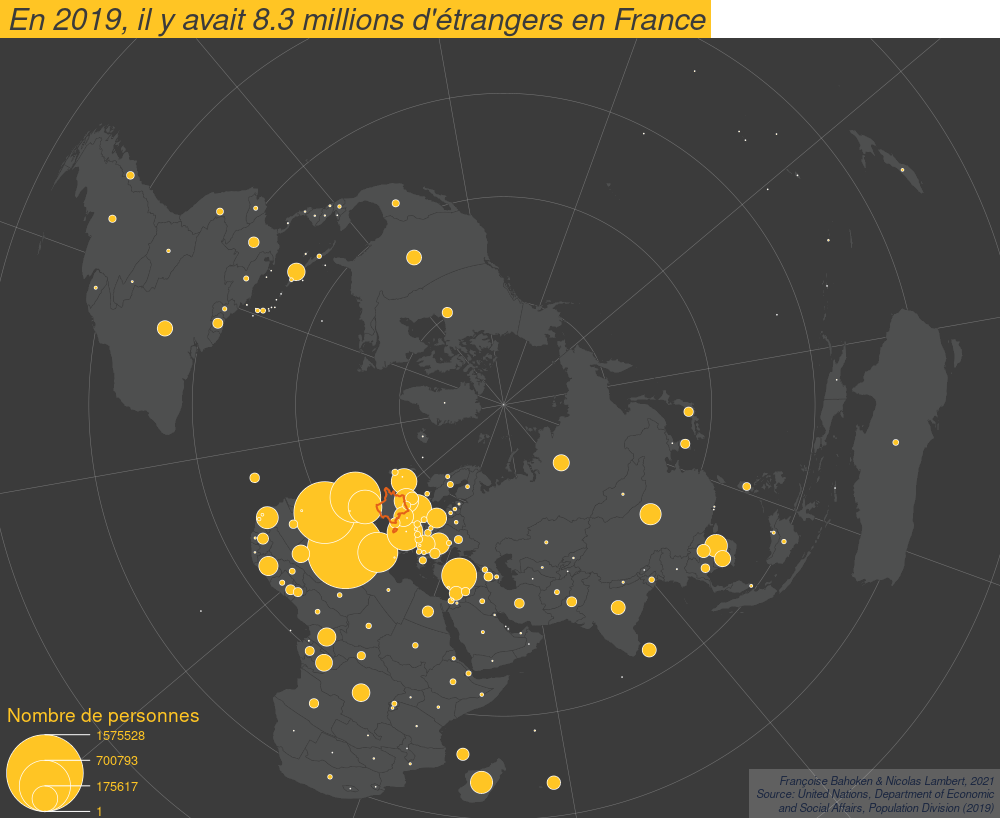

**Lorem Ipsum is simply dummy text of the printing and typesetting industry. Lorem Ipsum has been the industry's standard dummy text ever since the 1500s, when an unknown printer took a galley of type and scrambled it to make a type specimen book. It has survived not only five centuries, but also the leap into electronic typesetting, remaining essentially unchanged. It was popularised in the 1960s with the release of Letraset sheets containing Lorem Ipsum passages, and more recently with desktop publishing software like Aldus PageMaker including versions of Lorem Ipsum.**

# Les données

Les données utilisées ici ....

# Les packages

```{r, eval = FALSE, message = FALSE, warning = FALSE}
install.packages("sf")
install.packages("mapsf")
install.packages("remotes")
library(remotes)
install_github("riatelab/mapsf")
```

```{r, eval = TRUE, message = FALSE, warning = FALSE}
library("sf")
library("mapsf")
```

# Import et mise en forme des données

```{r, eval = TRUE, message = FALSE, warning = FALSE, results = "hide"}
countries <- st_read("data/world/geom/countries.gpkg")
graticule <- st_read("data/world/geom/graticule.gpkg")
bbox <- st_read("data/world/geom/bbox.gpkg")
migr <- read.csv("data/world/fij/migr2019_T.csv")

crs <- "+proj=aeqd +lat_0=90 +lon_0=50 +x_0=0 +y_0=0 +datum=WGS84 +units=m +no_defs "
countries <- st_transform(x = countries, crs = crs)
graticule <- st_transform(x = graticule, crs = crs)
bbox <- st_transform(x = bbox, crs = crs)
land <- st_union(countries)
```

Template cartographique


```{r, eval = TRUE, message = FALSE, warning = FALSE}
col = "#9F204280"
credit = paste0("Françoise Bahoken & Nicolas Lambert, 2021\n",
                  "Source: United Nations, Department of Economic\n",
                  "and Social Affairs, Population Division (2019)")
theme = mf_theme(x = "default", bg = "white", tab = FALSE, 
                   pos = "center", line = 2, inner = FALSE, 
                   fg = "#9F204270", mar = c(0,0, 2, 0),cex = 1.9)

template = function(title, file){

  mf_export(
    countries,
    export = "png",
    width = 1000,
    filename = file,
    res = 96,
    theme = theme, 
    expandBB = c(-.02,0,-.02,0)
  )
  mf_map(bbox, col = "#d5ebf2",border = NA, lwd = 0.5, add = TRUE)
  mf_map(graticule, col = "white", lwd = 0.5, add = TRUE)
  mf_map(countries, col = "#baaba2",border = "white", lwd = 0.5, add = TRUE)
  mf_map(land, col = NA,border = "#317691", lwd = 0.5, add = TRUE)
    # mf_map(links, col = NA,border = "#317691", lwd = 0.5, add = TRUE)
  mf_credits(
    txt = credit,
    pos = "bottomright",
    col = "#1a2640",
    cex = 0.7,
    font = 3,
    bg = "#ffffff30"
  )
  mf_title(title)
}
```

```{r, eval = TRUE, message = FALSE, warning = FALSE, results = "hide"}
template("Template cartographique", "maps/template.png")
dev.off()
```

</img>

# L'effet Spaghetti

```{r, eval = TRUE, message = FALSE, warning = FALSE}
links <- mf_get_links(x = countries, df = migr, x_id = "adm0_a3_is", df_id = c("i", "j"))
```


```{r, eval = TRUE, message = FALSE, warning = FALSE, results = "hide"}
template("L'effet Spaghetti ", "maps/spaghetti.png")
mf_map(links, col = col, add=TRUE)
dev.off()
```

</img>

# Répondre à des questions simples

```{r, eval = TRUE, message = FALSE, warning = FALSE}
knitr::kable(migr[c(0:10),], row.names = F, digits = 1)
```

**Question 1** : Combien y a t-il de migrants dans le monde en 2019 ?

```{r, eval = TRUE, message = FALSE, warning = FALSE}
paste0(sum(migr$fij) / 1000000, " millions")
```

**Question 2** : ...

# Prendre le prisme d'un seul pays

## Origine des migrants vivant en Afrique du Sud

Choix d'un pays

```{r, eval = TRUE, message = FALSE, warning = FALSE, results = "hide"}
ISO3 <- "FRA"
label = "France"
```

Jointure et mise ne forme des données

```{r, eval = TRUE, message = FALSE, warning = FALSE, results = "hide"}
countr <- countries[,c("adm0_a3_is","label")]
migr <- migr[migr$j == ISO3,]
tot <- sum(migr$fij)
migr <- rbind.data.frame(migr, c(i = ISO3,j = ISO3,fij = tot))
migr$fij <- as.numeric(migr$fij)
countr <- merge(x = countr,y = migr, by.x = "adm0_a3_is", by.y = "i", all.x = TRUE)
countr <- countr[-3]
colnames(countr) <- c("id","label","fij","geometry")
```

```{r, eval = TRUE, message = FALSE, warning = FALSE}
knitr::kable(countr[c(0:10),], row.names = F, digits = 1)
```

Une premiere carte simple

```{r, eval = TRUE, message = FALSE, warning = FALSE, results = "hide"}
template(paste0("Origine des personnes migrantes vivant en ",label," en 2019"), "maps/prop1.png")
mf_map(countr[countr$id == ISO3,], col = "#6b274f", border = "white", add = TRUE)
mf_map(countr[countr$id != ISO3,], var = "fij", col = "#c75b9a", border = "white", type = "prop",
       inches = 0.3, leg_title_cex = 1.2, leg_val_cex   = 0.8,
       leg_title = "Nombre de personnes")
dev.off()
```

</img>

Même information avec des lignes

```{r, eval = TRUE, message = FALSE, warning = FALSE, results = "hide"}
countr$dist = ISO3
links <- mf_get_links(x = countr, df = data.frame(countr), x_id = "id", df_id = c("id", "dist"))
links = links[links$id != ISO3,]
```

```{r, eval = TRUE, message = FALSE, warning = FALSE, results = "hide"}
template(paste0("Origine des personnes migrantes vivant en ",label," en 2019"), "maps/flows1.png")
mf_map(links, var = "fij", col = "#c75b9a", type = "prop",
       inches = 4, leg_title_cex = 1.2, leg_val_cex   = 0.8,
       leg_title = "Nombre de personnes")
mf_map(countr[countr$id == ISO3,], col = "#6b274f", border = "white", add = TRUE)
dev.off()
```

</img>

Une carte un peu plus sophistiquée


> https://analytics.huma-num.fr/Nicolas.Lambert/migrexplorer/


# Flowmapper

Carte polaire
Puis passer au globe....

