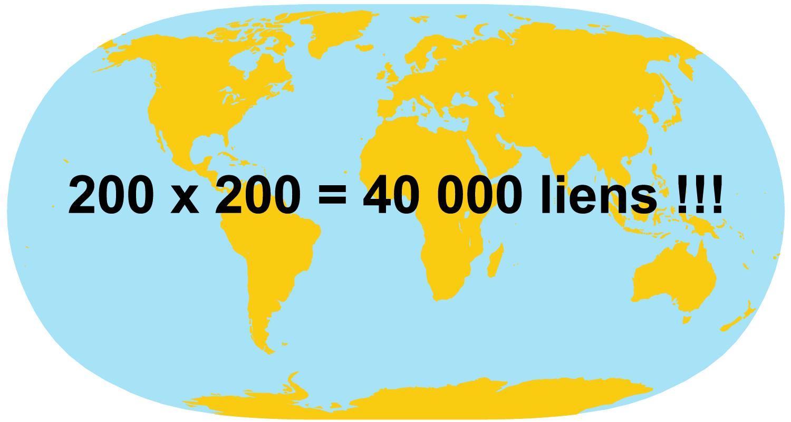

class: title-slide-custom

background-image: url(img/pop-art-arrows-set-vector-16884960.jpg)
background-size: cover

# Enjeux rhétoriques des cartes de flux

## Ecole thématique TRANSCARTO, Aussois.

### Nicolas Lambert, (`r Sys.Date()`) - nicolas.lambert@cnrs.fr

.logo[
</img>
]

---
class: inverse middle center 
La rhétorique kezako ?

---
# La rhétorique en cartographie
.center[]

???
La rhétorique c'est de l'action du discours sur les esprits. Le mot provient du latin rhetorica qui se traduit par « technique, art oratoire ».
On parlera alors d'eloquance quand un discours fait mouche. En d'autres termes, c'est l'art de la persuasion. 

---
# La rhétorique en cartographie
.center[]

---
# La rhétorique en cartographie
.center[ .note[William Bunge & Gwendolyn Warren]]

---
# La rhétorique en cartographie
.center[ .note[William Bunge & Gwendolyn Warren]]

---
# La rhétorique en cartographie
.center[ .note[Charles J. Minard, 1869]]

???

Cette carte qui représentante la campagne russe de l'armée française en 1812 est une véritable célébrité du monde de la visualisation de données. Pour Tuftee, c'est peut-être le meilleur graphique statistique jamais dessiné.

Minard admet que sa représentation visuelle repose sur certains choix qui sacrifient la précision au profit du récit. 

Par exemple, la carte ne mentionne pas Napoléon. Pour Tuftee, le but de Minard c'est que "toute l'attention doit être accordée à la commémoration des soldats morts plutôt qu'à la célébration de la célébrité survivante". Tufte suggère qu'il s'agit d'une carte anti-guerre, de la manière dont elle souligne les pertes humaines catastrophiques.

https://chezvoila.com/blog/minard-map/
https://digitalsocietyschool.org/wp/wp-content/uploads/2020/09/Tufte_BE_2006.pdf

---
class: inverse middle center 
Tout ce qui peut changer le message d'une carte de flux

---
# Enjeux de projection
.center[]

---
# Enjeux de projection
.center[]

---
# Enjeux de maillage (agrégations)
.center[]

---
# Enjeux de maillage (agrégations)
.center[]

---
# Enjeux de maillage (agrégations)
.center[]

---
# Enjeux de maillage (agrégations)
.center[]

---
# Enjeux de maillage (agrégations)
.center[]

---
# Enjeux de maillage (agrégations)
.center[]

---
# Enjeux de maillage (agrégations)
.center[ .note[by François Héran]]

---
# Enjeux de maillage (agrégations)
.center[ .note[by François Héran]]

---
# Enjeux de selection et cadrage
.center[]

---
# Enjeux de selection et cadrage
.center[]

---
# Enjeux de selection et cadrage
.center[]

---
# Enjeux de selection et cadrage
.center[]

---
# Enjeux de selection et cadrage
<video width="100%" controls>
  <source src="img/lucify1.mp4" type="video/mp4">
</video>
.note[La carte de Lucify (2015). Voir https://neocarto.hypotheses.org/1963]

---
# Enjeux d'habillage (les textes)
.center[ .note[Le Point 07/09/2015]]

---
# Enjeux de sémiologique graphique
<video width="100%" controls>
  <source src="img/lucify2.mp4" type="video/mp4">
</video>
.note[La carte de Lucify (2015). Voir https://neocarto.hypotheses.org/1963]

---
class: inverse middle center 
Quid de la fameuse carte de Frontex ?

---
# La carte de Frontex
.center[ .note[La rhétorique de Frontex]]

???

Cette carte, appelée "analyse trimestrielle des risques" vise donc à mettre en image les prétendues menaces auxquelles l'Union européenne est confrontée le long de ses frontières exterieures. Même si la carte est mise à jour tous les 3 mois, sa composition visuelle reste à peu près la même. 

Sur la carte, il y a des éléments statiques, inamovibles, que sont les Etats européens, que vient perturber une masse de lignes rouges gigantesques symbolisant les sans-papiers traversent leurs frontières, semblant perturber un ordre naturel. 

Bref, un agencement visuel discursif. 

Au niveau des mots, la carte parle de détections trimestrielles de traversée illégale de la frontière, 2015-2017 ", qui associe la migration sans papiers à une infraction criminelle.

Rappelons que l'illégalisation des sans-papiers est une construction politique

grille simpliste, déshumanisée et statique,
ordre européen auto-fabriqué dans lequel ceux qui le traversent sont décrits comme des contrevenants imprévus et anormaux et comme un danger pour l'ordre " naturel " de l'UE.
 
La carte ne tient pas compte du fait que bon nombre de pays situés sur le chemin des flèches

cartographique est profondément idéologique : elle revient à imposer une vision eurocentrique de l'immigration des sans-papiers et de l'imaginaire spatial qui l'accompagne.

---
# La carte de Frontex
.center[ .note[La rhétorique de Frontex]]

???
Et voiçi la même réalisée au moment de la crise dite migrtoire de 2015.

???

Cette carte, appelée "analyse trimestrielle des risques" vise donc à mettre en image les prétendues menaces auxquelles l'Union européenne est confrontée le long de ses frontières exterieures. Même si la carte est mise à jour tous les 3 mois, sa composition visuelle reste à peu près la même. 

Sur la carte, il y a des éléments statiques, inamovibles, que sont les Etats européens, que vient perturber une masse de lignes rouges gigantesques symbolisant les sans-papiers traversent leurs frontières, semblant perturber un ordre naturel. 

Bref, un agencement visuel discursif. 

Au niveau des mots, la carte parle de détections trimestrielles de traversée illégale de la frontière, 2015-2017 ", qui associe la migration sans papiers à une infraction criminelle.

Rappelons que l'illégalisation des sans-papiers est une construction politique

grille simpliste, déshumanisée et statique,
ordre européen auto-fabriqué dans lequel ceux qui le traversent sont décrits comme des contrevenants imprévus et anormaux et comme un danger pour l'ordre " naturel " de l'UE.
 
La carte ne tient pas compte du fait que bon nombre de pays situés sur le chemin des flèches

cartographique est profondément idéologique : elle revient à imposer une vision eurocentrique de l'immigration des sans-papiers et de l'imaginaire spatial qui l'accompagne.

---
# La carte de Frontex
.center[ .note[Van Houtum, H., & Bueno Lacy, R. (2020). The migration map trap. On the invasion arrows in the cartography of migration. Mobilities, 15(2), 196-219]]

???
Ce que je dis là, est tiré de l'article de Henk van Houtum et Rodrigo Bueno Lacyb publié en 2020. Cet article intitulé « The migration map trap. On the invasion arrows in the cartography of migration » (Le piège de la cartographie des migrations. Sur les flèches d'invasion dans la cartographie des migrations) ...

Dans leur article, les auteurs considèrent que la description cartographique que fait Frontex des migrations relève de la propagande et colporte une "déformation grossière" et "xenohobe", à mille lieu des travaux de la recherche géographique contemporaine. Ils concluent par un appel urgent à des cartographies de la migration plus solides scientifiquement, plus critiques et plus créatives. 

Ils considèrent que la représentation faite par l'agence n'est pas anecdotique, mais hégémonique. Selon eux, la disposition cartographique choisie par Frontex est devenue le modèle prédominant de la plupart des cartes des migrations des sans papiers sur Internet.

La fleche est le symbole privilegié, et souvent incontesté pour représenter le mouvement sur les cartes. Elle permet de représenter un trajet, un intnéraire, une direction, etc.
Cette fleche est d'ailleurs souvent rouge pour des questions de visibilité et de hiérarchisation de l'information. 

Mais couleur, la direction et la forme de ses flèches constituent une allégorie alertant le public sur la nécessité d'agir. Les flèches constituent une allégorie alertant le spectateur sur les multitudes de "corps indésirables" qui envahissent l'UE et apportent avec eux des menaces indéterminées.

de telles flèches alarmantes apparaissent traditionnellement sur les cartes de propagande et les cartes militaires.

Technique de cadrage

1 - elle délimite un projet politique "en danger" et le place au centre, suggérant ainsi une situation urgente et inévitable. Besoin de protéger sa vulnérabilité.

2 - elle ordonne son propre territoire en délimitant ses ses frontières

3 - sa périphérie comme une zone sans nom et apparemment sans fin, constituée de dispositifs symboliques menaçants. flèches,
des troupes, des avions ou des chars - qui n'ont pas de source précise et qui semblent donc venir de partout pour
empiéter sur leur cible.

---
# La flèche rouge
.center[]

???

Cette conception visuelle ne vise pas la précision scientifique mais plutôt l'efficacité graphique. Mais dui coup, elle véhicule un message simplifié : une confrontation existentielle entre amis et ennemis. Un imaginaire imminent et violent.

bleu pour son propre camp et rouge pour les forces "ennemies".

Les couleurs sont l'un des outils les plus puissants des cartographes pour transmettre un message et il serait naïf de penser que les cartographes de Frontex n'en sont pas conscients.

Qui plus est, la migration des sans-papiers n'a pas la vitesse d'une invasion militaire. 

---
# Nous et eux
.center[]

???

Exemple de la carte de la suprématie blanche rédigée par un terroriste d'extrême droite américain.

Il est inquiétant de constater que la carte Frontex est l'héritière de cette tradition d'encerclement menaçant. Elle
devrait être considérée comme une composition cartographique extrémiste, car un argument visuel qui présente un ensemble de flèches d'envahisseurs entourant un pays sans défense est un argument de poids.

récit de la "survie de la civilisation" Grand remplacement.

---
# Nous et eux
.center[]

???

vidéo de propagande réalisée par Geert Wilders - un politicien néerlandais eurosceptique et islamophobe.
Dans cette vidéo, il fustige l'immigration musulmane et les musulmans et africains tout en promouvant les tropes racistes classiques de la surpopulation par des immigrants sombres, culturellement menaçants et appauvris.

---
class: inverse middle center 
Alternatives

---
# Alternatives (des représentations non géographiques)
.center[]

---
# Alternatives (changer d'échelle)
.center[]

---
# Alternatives (réintroduire le temps)
.center[]

---
# Alternatives (réintroduire le temps)
.center[]

---
# Alternatives (casser la linéarité)
.center[]

???

Qui plus est, la migration des sans-papiers est souvent tout sauf une ligne droite. La continuité lisse et la rectitude des flèches de la carte de Frontex favorisent les distorsions géographiques et temporelles qui déforment l'expérience douloureuse des sans-papiers, en faisant croire qu'ils choisiraient d'aller d'un point de départ à un point de destination avec la même absence d'obstacles.

---
# Alternatives (circulation)
.center[]

---
# Alternatives (circulation)
.center[]

---
class: inverse middle center 
« On ne pense jamais qu'avec ses affects »

.note[(F. Lordon, 2015. Imperium : Structures et affects des corps politiques.)]

???

Cette phrase a un double en sens. Elle signifie qu’on ne pense jamais seulement avec ses affects. On pense bien sûr avec sa raison, on peut avoir un approche rationnelle et scientifique pour penser l’espace géographique. Heureusement ! Mais elle signifie également qu’on pense aussi toujours avec ses affects. Lorsqu’on raisonne, on le fait via une structure mentale qui a été construite depuis la naissance dans un environnement social et culturel donné. On ne peut penser « hors sol » en s’abstrayant de toute construction sociale.

---
class: clear, bottom

.big[
# MERCI
]

`BLOG` 
[**neocarto.hypotheses.org**](https://neocarto.hypotheses.org/)

`E-MAIL` 
[**nicolas.lambert@cnrs.fr**](mailto:nicolas.lambert@cnrs.fr)

`TWITTER` 
[**@neocartocnrs**](https://twitter.com/neocartocnrs)

`GITHUB` 
[**github.com/neocarto**](https://github.com/neocarto)
