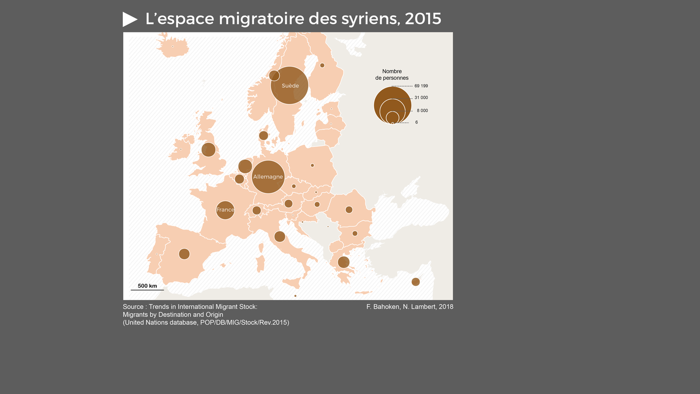

class: title-slide-custom

background-image: url(img/pop-art-arrows-set-vector-16884960.jpg)
background-size: cover

# Enjeux rhétoriques des cartes de flux

## Ecole thématique TRANSCARTO, Aussois.

### Nicolas Lambert, (`r Sys.Date()`) - nicolas.lambert@cnrs.fr

.logo[
</img>
]

---
class: inverse middle center 
La rhétorique kezako ?

---
# La rhétorique en cartographie
.center[]

???
Qu’est ce que la rhétorique ? C’est de l'action du discours sur les esprits. Le mot provient du latin rhetorica qui se traduit par « technique, art oratoire ». On parlera alors d’éloquence quand un discours fait mouche. En d'autres termes, La rhétorique c'est l'art de la persuasion. 

En considère bien souvent qu’il y a trois leviers principaux pour toucher un auditoire. Le Logos, l’ethos et le Pathos. 

---
# La rhétorique en cartographie
.center[]

???
Ces principes de la rhétoriques s'appliquent tout autant au langage cartographique. Chaque carte, en effet, contient des éléments factuels et d'éléments rhétoriques.

Les cartes peuvent être trompeuses, manipulatoire. Important de savoir séparer le bon grain de l'ivraie, savoir déterminer ce qui relève du factuel et ce qui relève de choix graphiques de communication. Avoir ça en tête est le seul moyen pour avoir un usage éclaire des cartes. Cela demande de l'apprentissage, de l'esprit critique, sans tomber dans le complotisme, le relativisme ou autre théorie du complot.

Tout comme un dicours, une carte aura d'autant plus de chance de convaincre un auditoire qu'elle mobilisera le logos, le patos et l'ethos. 

---
# La rhétorique en cartographie
.center[ .note[William Bunge & Gwendolyn Warren]]

???
Exemple avec cette carte de Wiliamm Bunge.

Rappel, William Bunge est une géographe américain né en 1928 dans le Wisconsin (USA) qui fut pendant très longtemps une figure de prou de la géographie quantitative.
Mais il a surtout porté une démarche radicale de la géographie, une géograĥie hors des murs de l'université dont il s'est fait viré en 1967, considéré comme sympathisant communiste. 

Il fonde à cette époque (en 1968) avec Gwendolyn Warren l’expédition géographique de Detroit (Detroit Geographic Expedition) qui mobilise ses techniques de geo quanti pour faire de la géographie sociale avec et pour les habitants des quartiers pauvres de Détroit. C'ets juste après les grandes émeutes raciales qui ont eu lieu dans la vile. Toute cette époque est rassemùblée dans un bouquin qu'on peut aujourd'hui trouver sur internet. Il va donc très vite utiliser des mesures pas vraiment « conventionnelles » pour l'époque... L'accès aux jouets pour les enfants des qurtiers pauvres... Ses productions cartographiques, hors du monde universitaire, vont marquer un important tournant
dans la façon de représenter certains faits sociaux et notamment les inégalités entre communautés !

Où les navetteurs écrasent les enfants noirs sur la route Pointes-Downtown

Cette carte en noir et blanc représente un quartier de détroit, ses zones résidentielles et les routes empruntées par les navetteurs qui le traversent. Ce quartier de détroit est situé entre les banlieues blanches aisées à l’est et le centre-ville à l’ouest. De par sa localisation, il subit des flux incessants de voitures, avec un risque d’accident mortel important pour les enfants du quartier. Sur la carte, des points noirs représentent ces “accidents” (enfants du quartier tués par des voitures). Avant ces travaux, personne ne tenait le registre du nombre de morts. Pour Denis Wood, dans son livre Rethinking the Power of Maps, cette carte est à considérer comme une “carte de meurtre” où les navetteurs blancs, en se précipitant vers et depuis le travail, écrasent des enfants noirs. C’est “une carte où des adultes blancs tuent des enfants noirs”.

---
# La rhétorique en cartographie
.center[ .note[William Bunge & Gwendolyn Warren]]

???
Cette seconde carte cartographie le enfants mordus par des rats. Au delà de la donnée en tant que telle, Bunge mobilse là une véritable téhnique rhétorique : donner à voir un fait precis, saillant, qui au delà de lui même, mobilise l'imaginaire pour évoquer tout un monde. Ici, c'ets la misère sociale qui ets cartographiée. 

---
# La rhétorique en cartographie
.center[ .note[Charles J. Minard, 1869]]

???
La berezina
442 000 hommes au départ, 100 000 à Moscou, 10 000 à l'arrivée. 
Enfin, on peut aussi reveir sur cette carte de Minard dont Françoise a parlé. 
Elle représentante la campagne russe de l'armée française en 1812 (et retraite en 1813). Cette carte est une véritable célébrité du monde de la visualisation de données.
Pour Tuftee, c'est peut-être le meilleur graphique statistique jamais dessiné.

Minard admet que sa représentation visuelle repose sur certains choix qui sacrifient la précision au profit du récit. 

Par exemple, la carte ne mentionne pas Napoléon. Pour Tuftee, le but de Minard c'est que "toute l'attention doit être accordée à la commémoration des soldats morts plutôt qu'à la célébration de la célébrité survivante". Tufte suggère qu'il s'agit d'une carte anti-guerre, de la manière dont elle souligne les pertes humaines catastrophiques.

https://chezvoila.com/blog/minard-map/
https://digitalsocietyschool.org/wp/wp-content/uploads/2020/09/Tufte_BE_2006.pdf

---
class: inverse middle center 
Tout ce qui peut changer le message d'une carte de flux

???
Explorer tous les éléments graphiques qui vont au delà de la donnée et qui peut changer radicalement l'alure ; le message ; de la carte.

---
# Enjeux de projection
.center[]

???
Le choix de la projection va influer sur le point de vue. Qui ets au centre. Qui est en haut. Qui est en bas. 

Cela va influer aussi beaucoup sur la longueur des flux, sur leur tracés, leur surface perçue. 

---
# Enjeux de projection
.center[]

Bien souvent, on utilisera des système de projection polaires, 

---
# Enjeux de maillage (agrégations)
.center[]

???
Autre élément important, quand on fait des carte de flux, on a souvent beaucoup d'information à représenter. 

---
# Enjeux de maillage (agrégations)
.center[]

---
# Enjeux de maillage (agrégations)
.center[]

---
# Enjeux de maillage (agrégations)
.center[]

---
# Enjeux de maillage (agrégations)
.center[]

---
# Enjeux de maillage (agrégations)
.center[]

???
Du coup, on va souvent passer par des maillages agrégés. Attention, chaque facçon d'aggreger les pays va construire un massage cartoi différent.
Ici, on a une flèche rouge de l'Afrique vers l'Europe

---
# Enjeux de maillage (agrégations)
.center[ .note[by François Héran]]

???
Ici, on a une Afrique encore isolée dans la mondialisation.

---
# Enjeux de selection et cadrage
.center[]

???
Faire une carte, c'est aussi définir ce qui rentre et ce qui ne rentre pas dans le cadre. Exemple, cette carte des réfugiés syriens au moment de la crise dite migratoire de 2015.

---
# Enjeux de selection et cadrage
.center[]

---
# Enjeux de selection et cadrage
.center[]

---
# Enjeux de selection et cadrage
.center[]

---
# Enjeux de selection et cadrage
<video width="100%" controls>
  <source src="img/lucify1.mp4" type="video/mp4">
</video>
.note[La carte de Lucify (2015). Voir https://neocarto.hypotheses.org/1963]

???
Cela est tout aussi vrai avec d'autres modes de représentation. 
Largement relayée sur les réseaux sociaux, cette carte issue du site Lucify publiée en 2015, met en scène les flux de demandeurs d’asiles vers l’Union européenne sur la période 2012-2015. En ne selectionnnant que les flux vers l'Europe => une image biaisée et européo centrée des flux migratoires.

Le site de la banque mondiale nous informe par exemple que la Turquie accueille 1 587 374 réfugiés sur la période 2011-2015 contre seulement 252 264 pour la France 

---
# Enjeux d'habillage (les textes)
.center[ .note[Le Point 07/09/2015]]

???
Les mots des cartes sont aussi importants.
Changer un mot : clandestion / exilés peut changer completement le sens de la carte.
Idem pour la hiérarchisation : Ici, Europe est en gras en lettres capitales. C'ets clairement le point de vue de la carte.

---
# Enjeux de sémiologique graphique
<video width="100%" controls>
  <source src="img/lucify2.mp4" type="video/mp4">
</video>
.note[La carte de Lucify (2015). Voir https://neocarto.hypotheses.org/1963]

???
Et puis il y a tous les aspects liés à la sémiologie graphique.

Une sémiologie grahique discutable : les migrants ne sont pas des missiles.
Une rhétorique guerrière, mais qui est vraissemblablement maladroite. 
Chaque trait (qui représente 25 ou 50 personnes) suit une trajectoire rectiligne comme un missile lancé vers l’Europe. 
Cette sémiologie graphique décrit, par son mouvement, un flux migratoire en continu qui ne se tarit jamais, jusqu’au débordement. 
tte sémiologie graphique met en scène un scénario d’invasion, quasi militaire, avec des pays européens attaqués (et envahis) par les étrangers

---
class: inverse middle center 
Quid de la fameuse carte de Frontex ?

---
# La carte de Frontex
.center[ .note[La rhétorique de Frontex]]

???

Cette carte, appelée "analyse trimestrielle des risques" vise donc à mettre en image les prétendues menaces auxquelles l'Union européenne est confrontée le long de ses frontières exterieures. Même si la carte est mise à jour tous les 3 mois, sa composition visuelle reste à peu près la même. 

Sur la carte, il y a des éléments statiques, inamovibles, que sont les Etats européens, que vient perturber une masse de lignes rouges gigantesques symbolisant les sans-papiers traversent leurs frontières, semblant perturber un ordre naturel. 

Bref, un agencement visuel discursif. 

Au niveau des mots, la carte parle de détections trimestrielles de traversée illégale de la frontière, 2015-2017 ", qui associe la migration sans papiers à une infraction criminelle.

Rappelons que l'illégalisation des sans-papiers est une construction politique

grille simpliste, déshumanisée et statique,
ordre européen auto-fabriqué dans lequel ceux qui le traversent sont décrits comme des contrevenants imprévus et anormaux et comme un danger pour l'ordre " naturel " de l'UE.
 
La carte ne tient pas compte du fait que bon nombre de pays situés sur le chemin des flèches

cartographique est profondément idéologique : elle revient à imposer une vision eurocentrique de l'immigration des sans-papiers et de l'imaginaire spatial qui l'accompagne.

---
# La carte de Frontex
.center[ .note[La rhétorique de Frontex]]

???
Et voiçi la même réalisée au moment de la crise dite migrtoire de 2015.
Les flux issus de la Syrie, d'Irak et d'Afghanistan deviennnet carrément violet ecarlate. 

---
# La carte de Frontex
.center[ .note[Van Houtum, H., & Bueno Lacy, R. (2020). The migration map trap. On the invasion arrows in the cartography of migration. Mobilities, 15(2), 196-219]]

???
La critique ces cartes de Frontex a été détaillée dans cet article de Henk van Houtum et Rodrigo Bueno Lacyb publié en 2020
« The migration map trap. On the invasion arrows in the cartography of migration » (Le piège de la cartographie des migrations. Sur les flèches d'invasion dans la cartographie des migrations) ...

Cette carte = déformation grossiere, xénophobe.

Vision qui est devenue hégémonique (loin d'être anecdotique)

Technique de cadrage

1 - Un centre comme projet politique "en danger", suggérant ainsi une situation urgente et inévitable. Besoin de protéger sa vulnérabilité.
3 - En pérophérie, une zone sans nom et apparemment sans fin, constituée de dispositifs symboliques menaçants. flèches, des troupes, des avions ou des chars - qui n'ont pas de source précise et qui semblent donc venir de partout pour empiéter sur leur cible.

La fleche est le symbole privilegié, et souvent incontesté pour représenter le mouvement sur les cartes. Elle permet de représenter un trajet, un intnéraire, une direction, etc.
Cette fleche est d'ailleurs souvent rouge pour des questions de visibilité et de hiérarchisation de l'information. 
Mais couleur, la direction et la forme de ses flèches constituent une allégorie alertant le public sur la nécessité d'agir. Les flèches constituent une allégorie alertant le spectateur sur les multitudes de "corps indésirables" qui envahissent l'UE et apportent avec eux des menaces indéterminées.

De telles flèches alarmantes apparaissent traditionnellement sur les cartes de propagande et les cartes militaires.

Ils concluent par un appel urgent à des cartographies de la migration plus solides scientifiquement, plus critiques et plus créatives. 

---
# La flèche rouge
.center[]

???

Ces fleches rouges, ne visent pas la précision scientifique, mais la simplification du message, l'efficacité graphique. Or, c'est une symbolique souvent utilisée sur les cartes pour décrire une confrontation existentielle entre ennemis et ennemis. Un imaginaire imminent et violent.

bleu pour son propre camp et rouge pour les forces "ennemies".

Les couleurs sont l'un des outils les plus puissants des cartographes pour transmettre un message et il serait naïf de penser que les cartographes de Frontex n'en sont pas conscients.

Qui plus est, la migration des sans-papiers n'a pas la vitesse d'une invasion militaire. 

---
# Nous et eux
.center[]

???
Ce type de cartes, avec un territoire au centre, et une périphérie de laquelle viennnet de grosses fleches envahissantes, est une rhétorique bien huilée. 

Exemple avec cette carte de "la suprématie blanche" réalisée par un terroriste d'extrême droite américain.

Il est inquiétant de constater que la carte Frontex est l'héritière de cette tradition d'encerclement menaçant. Elle
devrait être considérée comme une composition cartographique extrémiste, car un argument visuel qui présente un ensemble de flèches d'envahisseurs entourant un pays sans défense est un argument de poids.

Récit de la "survie de la civilisation" Grand remplacement.

---
# Nous et eux
.center[]

???

On retrouve également cette rhétorique dans cette carte issue de la vidéo de propagande réalisée par Geert Wilders - un politicien néerlandais eurosceptique et islamophobe.
Dans cette vidéo, il fustige l'immigration musulmane et les musulmans et africains tout en promouvant les tropes racistes classiques de la surpopulation par des immigrants sombres, culturellement menaçants et appauvris.

---
class: inverse middle center 
Alternatives

???
Alors quelles sont les laternatives ?

Il y en a plein.

---
# Alternatives (des représentations non géographiques)
.center[]

???
On peut par exemple proposer des représentation non géographiques.
Ca permet de montrer que les riches vont chez les riches.
Et que ce ne sont pas le splus pauvres qui migrent.
Mais c'est un peu esquiver le sujet. 

---
# Alternatives (changer d'échelle)
.center[]

???
On peut aussi changer d'échelle.

Carte réalisée avec FB.
Passer de la donnée aggrégée au parcours individuelle permet de l'humaniser, sa sinuosité, ses dificultés, etc. ^
De raconter une histoire vécue plutpot que celle d'un agrégat

---
# Alternatives (réintroduire le temps)
.center[]

Idem avec cette carte qui raconte la vie de Julienne, un récit reconstruit par Camiulle Schmoll.

---
# Alternatives (réintroduire le temps)
.center[]

Prise en compte du temps.
Tous les déplacement ne sont pas à la vitesse d'une invasion militaire.

---
# Alternatives (casser la linéarité)
.center[]

???

Qui plus est, la migration des sans-papiers est souvent tout sauf une ligne droite. La continuité lisse et la rectitude des flèches de la carte de Frontex favorisent les distorsions géographiques et temporelles qui déforment l'expérience douloureuse des sans-papiers, en faisant croire qu'ils choisiraient d'aller d'un point de départ à un point de destination avec la même absence d'obstacles.

---
# Alternatives (circulation)
.center[]

???
Voloté de casser la sybolique unidirectyionnelle des flux
Au profit d'une logique circulaire.

---
# Alternatives (circulation)
.center[]

???

« La grande roue africaine » - Esquisse présentée au musée d'art moderne à Vienne (Autriche) en novembre 2007 lors de l'exposition "Waypoint to Sharon Stone" (Rendez-vous à Sharon Stone).

« L’Afrique sauve l’Europe, qui appauvrit l’Afrique, qui nourrit l’Europe, qui asservit l’Afrique, qui paye l’Europe, qui continue de piller l’Afrique… (...)" 

---
class: inverse middle center 
« On ne pense jamais qu'avec ses affects »

.note[(F. Lordon, 2015. Imperium : Structures et affects des corps politiques.)]

???

En conclusion, une carte c'est des faits, des données des méthodes, des techniques. Mais c'est aussi des choix graphiques qui produisent un disours. Quand on a une carte sous les yeux, il est important de savoir faire ce travail. Ce qui relève du factuel et ce qui relève d'une stratégie de communication.

Cette phrase a un double en sens. Elle signifie qu’on ne pense jamais seulement avec ses affects. On pense bien sûr avec sa raison, on peut avoir un approche rationnelle et scientifique pour penser l’espace géographique. Heureusement ! Mais elle signifie également qu’on pense aussi toujours avec ses affects. Lorsqu’on raisonne, on le fait via une structure mentale qui a été construite depuis la naissance dans un environnement social et culturel donné. On ne peut penser « hors sol » en s’abstrayant de toute construction sociale.

---
class: clear, bottom

.big[
# MERCI
]

`BLOG` 
[**neocarto.hypotheses.org**](https://neocarto.hypotheses.org/)

`E-MAIL` 
[**nicolas.lambert@cnrs.fr**](mailto:nicolas.lambert@cnrs.fr)

`TWITTER` 
[**@neocartocnrs**](https://twitter.com/neocartocnrs)

`GITHUB` 
[**github.com/neocarto**](https://github.com/neocarto)
