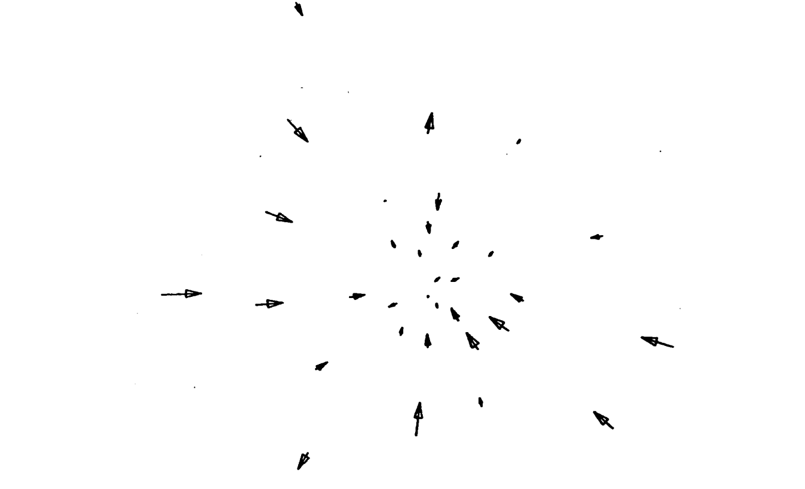
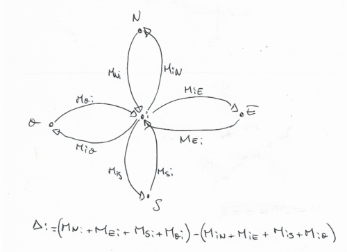
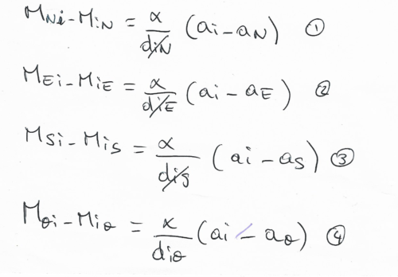
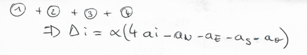
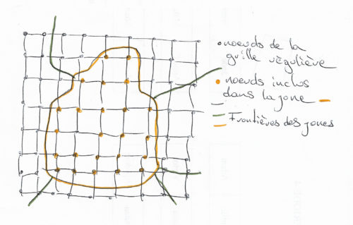
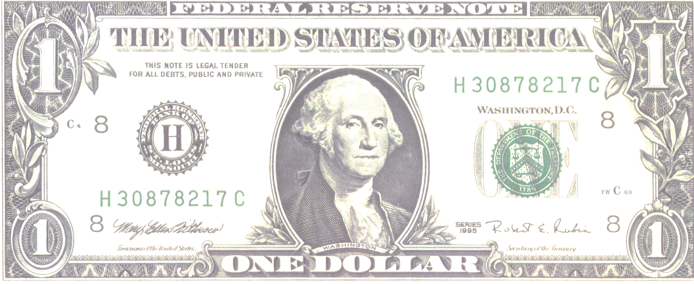
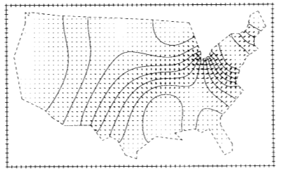
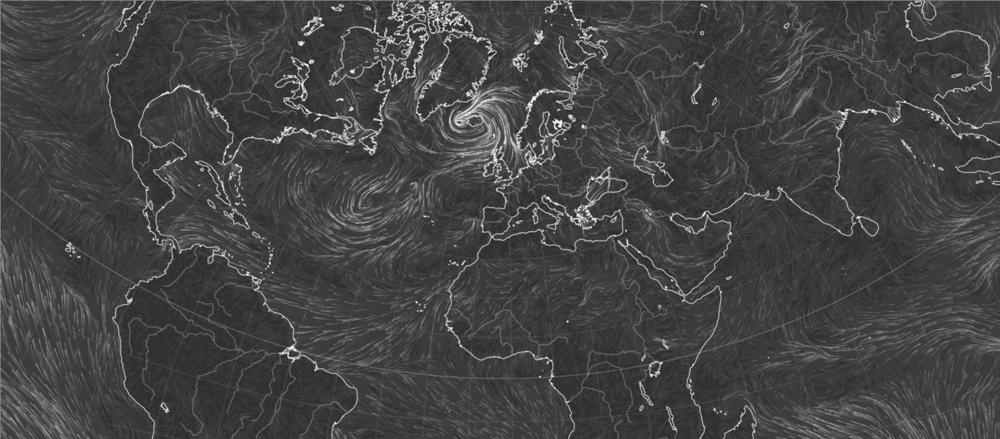

```{r setup, include=FALSE}
knitr::opts_chunk$set(echo = FALSE)
```
```{r setuplib, echo = FALSE,error=FALSE,warning=FALSE,results='hide',message=FALSE}
library(ttt)
library(Matrix)
library(sf)
library(dplyr)
library(ggplot2)
```

## Tobler et le mouvement

**Geographical Movement**

*is critically important.*

*This is because much **change** in the world is due to geographical movement.*

*The movement of ideas, people, disease, money, energy, material, etc.*

*W. Tobler*

## Travaux de tobler sur ODs et champs vectoriels

Quelques pointeurs :

- [1] Tobler, W.R. (1981), A Model of Geographical Movement. Geographical Analysis, 13: 1-20. [doi:10.1111/j.1538-4632.1981.tb00711.x](https://onlinelibrary.wiley.com/doi/pdf/10.1111/j.1538-4632.1981.tb00711.x)
- [2]  Tobler, W. (1975). [Spatial Interaction Patterns](http://pure.iiasa.ac.at/id/eprint/241/1/RR-75-019.pdf). IIASA Research Report. IIASA, Laxenburg, Austria: RR-75-019  
- [3] Tobler W. R. A Movement Talk [(slides)](https://www.comeetie.fr/partage/AMovementTalk.pps)
- [4] Tobler W. R. (2005) Asymmetry to Potentials [(slides)](https://neocarto.hypotheses.org/files/2020/04/Asymmetry-to-Potentials.pps)


## Champ et données ponctuelle

- Tobler s'intéresse très tôt à ces questions et propose de résumer une matrice OD spatialisée à l'aide d'un *champ de vecteurs*. 

- Il propose par exemple de calculer les vecteurs suivants en chacun des lieux:

$$\vec{c_i} = \frac{1}{n-1}\sum_{j\neq i}\frac{1}{dist(i,j)}\frac{M_{ij}-M_{ji}}{M_{ij}+M_{ji}}(\vec{x_j}-\vec{x_i})$$

## Champ 

Il cherche a construire et représenter le **champ vectoriel** (*le vent*) qui permettrait d'expliquer au mieux les mouvements observés. La métaphore physique est déjà utilisée.

## Munich

- Exemple avec les données de Munich (ttt vise aussi a faciliter la ré-utilisation des données historique de W. Tobler)
```{r munich,echo=TRUE,eval=FALSE}
data(munich)
sf=ttt:::mean_od_vectors(munich$coords,munich$OD)
arr = arrow(angle=15,length = unit(0.3,"cm"),type = "closed")
ggplot(sf)+geom_segment(aes(x=x,y=y,xend=x+dx*100,yend=y+dy*100),
                        arrow = arr)+
  theme_void()
```

## Munich
```{r munichfig,eval=TRUE}
data(munich)
sf=ttt:::mean_od_vectors(munich$coords,munich$OD)
arr = arrow(angle=15,length = unit(0.3,"cm"),type = "closed")
ggplot(sf)+geom_segment(aes(x=x,y=y,xend=x+dx*100,yend=y+dy*100),
                        arrow = arr)+
  theme_void()
```

## Munich



## Attractivité et données ponctuelles

Premiers travaux (données ponctuelles + ODs)

Ces travaux s'articulent et se formalisent au travers de l'introduction de deux objets :

- un **champ potentiel** (qui associe un chiffre a chaque lieu synthétisant son **attractivité**) 
- un **champ vectoriel** (dérivée du champ potentiel et décrivant le **mouvement**)

## Attractivité et données ponctuelles
### Hypothèse 

</br>
La **disymétrie** entre deux flux $M_{ij}$ et $M_{ji}$ est proportionelle à la **différence d'attractivité** entre $i$ et $j$ modulé par la distance entre $i$ et $j$.

$$M_{ij}-M_{ji}\propto\frac{(A_i-A_j)}{dist(i,j)}$$


## Attractivité et données ponctuelles

### Données ponctuelles + ODs

$$\color{blue}{D}.\color{red}{A}=\color{green}{\Delta}$$
avec :

- $\color{blue}{D}$ matrice modélisant l'influence des distances $D_{ij}=-\frac{1}{dist(i,j)}$ et $D_{kk}=\sum_{i,i\neq k}\frac{1}{dist(i,k)}$, 
- $\color{red}{A}$ le vecteur d'attractivité recherché 
- $\color{green}{\Delta}$ le vecteur de balance $\Delta_{k}=\sum_iM_{ik} - \sum_jM_{kj}$. 
 
Solution **unique** à un facteur additif près.  


## Construction d'un champ continu

Même modèle, même hypothèses mais les déplacements ne peuvent se faire qu'entre nœuds voisins positionnés sur une grille régulière :

</img>


## Construction d'un champ continu

On obtient pour chaque noeuds 4 équations reliant les flux aux attractivités :

</img>

## Construction d'un champ continu

Qui une fois combinées lient les $\color{green}{\Delta}$ aux attractivités :

</img>

et forment un système d'équation linéaire avec des liens fort avec la physique (équation de poisson).

<b>Rmq :</b> Manque juste les équations au bord du domaine qui encoderont le fait que le système est clos (pas de fuites)


## Construction d'un champ continu

Pour utiliser cette approche il suffit d'affecter un $\color{green}{\Delta}$ à chaque nœuds de la grille. 

Solution proposée par <i>Tobler</i> avec des données spatiales zonales affectation uniforme (ou pondéré) des $\color{green}{\Delta}$ :

</img>

## Construction d'un champ

En résumé :

- *Rasteriser* les polygones sur une grille régulière, 
- i.e. affecter à chaque nœud de la grille le $\color{green}{\Delta}$ du polygone qui le contient pondéré par le nombre de nœud à l'interieur du polygone
- Résoudre l'équation de poisson pour obtenir le champ potentiel i.e. *l'attracivité* de chaque nœud
- Calculer le champs vectoriel en différenciant l'attractivité 

## Exemple historique
</img>


## Exemple historique (dollars)

```{r dollars,echo=TRUE,eval=FALSE}
# chargement des données
data("dollars")
# calcul des deltas (balance)
delta = rowSums(dollars$OD)-colSums(dollars$OD)
dollars$polygones$delta=delta

# un jolie petit cadre
vintage_frame(dollars$polygones)
# affichage des contours
plot(st_geometry(dollars$polygones),add=TRUE)
# affichage des balances +/-
plus_minus_map(dollars$polygones,"delta")
```

## Exemple historique (dollars)

```{r dollarspm}
# chargement des données
data("dollars")
# un jolie petit cadre
vintage_frame(dollars$polygones)
# calcul des deltas (balance)
delta = rowSums(dollars$OD)-colSums(dollars$OD)
dollars$polygones$delta=delta
# affichage des contours
plot(st_geometry(dollars$polygones),add=TRUE)
# affichage des balances
plus_minus_map(dollars$polygones,"delta")
```


## Exemple historique (dollars)

```{r field,echo=TRUE,eval=FALSE,cache=TRUE}
pot.dollars = compute_poisson_potential(dollars$polygones,
                                varname = "delta",
                                method = "jacobi",
                                nb_it=1000)
pot.dollars = compute_poisson_potential(dollars$polygones,cellsize = 5000)
```

```{r fieldload,eval=TRUE}
pot.dollars = readRDS("./pot_dollars.RDS")
```


```{r}
str(pot.dollars)
```

## Visualisation du potentiel d'attractivité
```{r fieldplot,echo=TRUE,eval=FALSE}
plot(pot.dollars %>% select(attractivity))
```

## Visualisation du potentiel d'attractivité
```{r}
plot(pot.dollars %>% select(attractivity))
```


## Visualisation du champ vectoriel
```{r, echo=TRUE,eval=FALSE,warning=FALSE}
par(mar=c(0,0,0,0))
vintage_frame(dollars$polygones)
plot(st_geometry(dollars$polygones),add=TRUE)
poisson_flows(pot.dollars,normfact = 0.01)
```

## Visualisation du champ vectoriel
```{r,warning=FALSE}
par(mar=c(0,0,0,0))
vintage_frame(dollars$polygones)
plot(st_geometry(dollars$polygones),add=TRUE)
poisson_flows_map(pot.dollars,normfact = -0.01)
```

## Visualisation du champ vectoriel



```{r,warning=FALSE}
#params = list(lifespan=500,scalefact=0.1,linewidth=1,nbparticules=300,resolution=100)
#d3data = list(params=params,data=pot.dollars)
#r2d3::r2d3(d3data,"../ttt/d3/wind.js",container = "canvas",d3_version = "4")
```

## Droplets

Pour finir de filer la métaphore 

et faire *une carte de mouvements* en *mouvement* 

il est possible d'utiliser les **droplets**

## Droplets

Confession, j'ai longtemps admirer earth.nullschool.net :

<a href="https://earth.nullschool.net/"></a>


## Droplets

Recette :

- lâcher quelques centaine de **particules** dans le champs,
- à chaque pas de temps faire **évoluer leurs positions** suivant le champ
- mettre à jour la visualisation avec les nouvelles positions 
- en gardant la visualisation précédente mais en **l'atténuant** pour créer un effet de traînée
- à partir d'un certains temps **ré-initialiser** la position de la particule de manière aléatoire

## Wind
<a href="https://www.comeetie.fr/galerie/wind/"></a>

## Limites // discussion 

- Territoire continu *quid des îles* 
- Pas de fuites ?
- Utilisation uniquement des $\color{green}{\Delta}$
- *Neutralité* de la représentation ? 
- Légende à la fois inutile et *importante*


